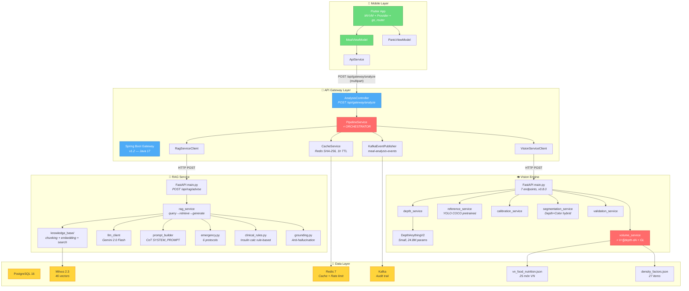
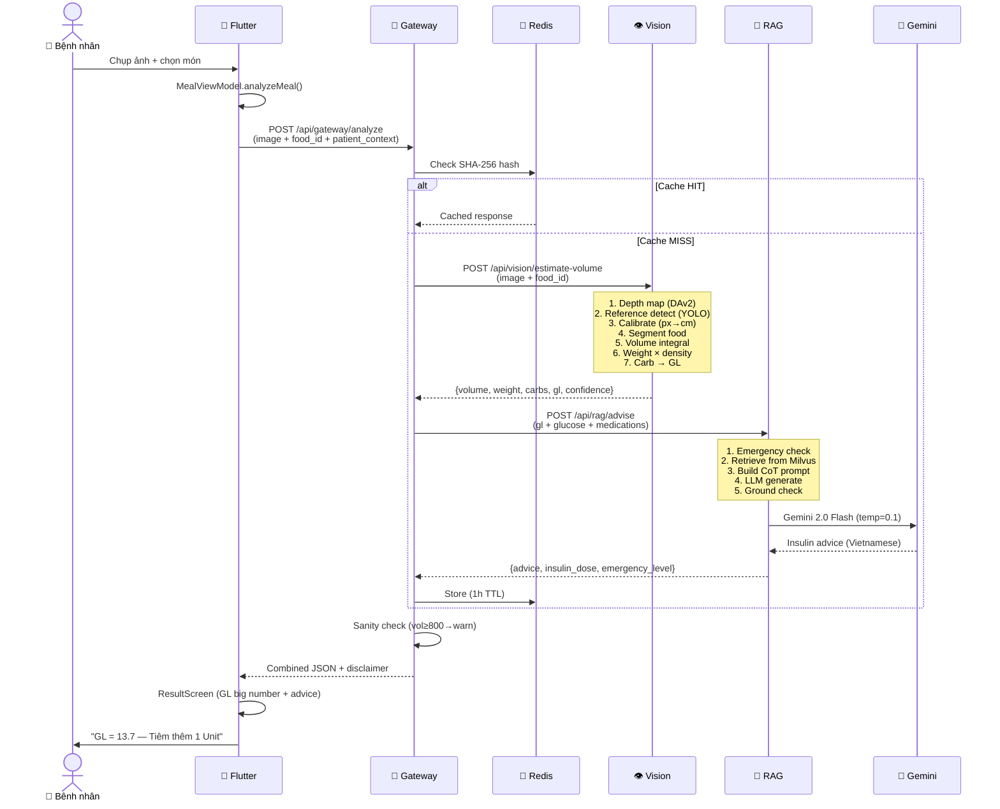
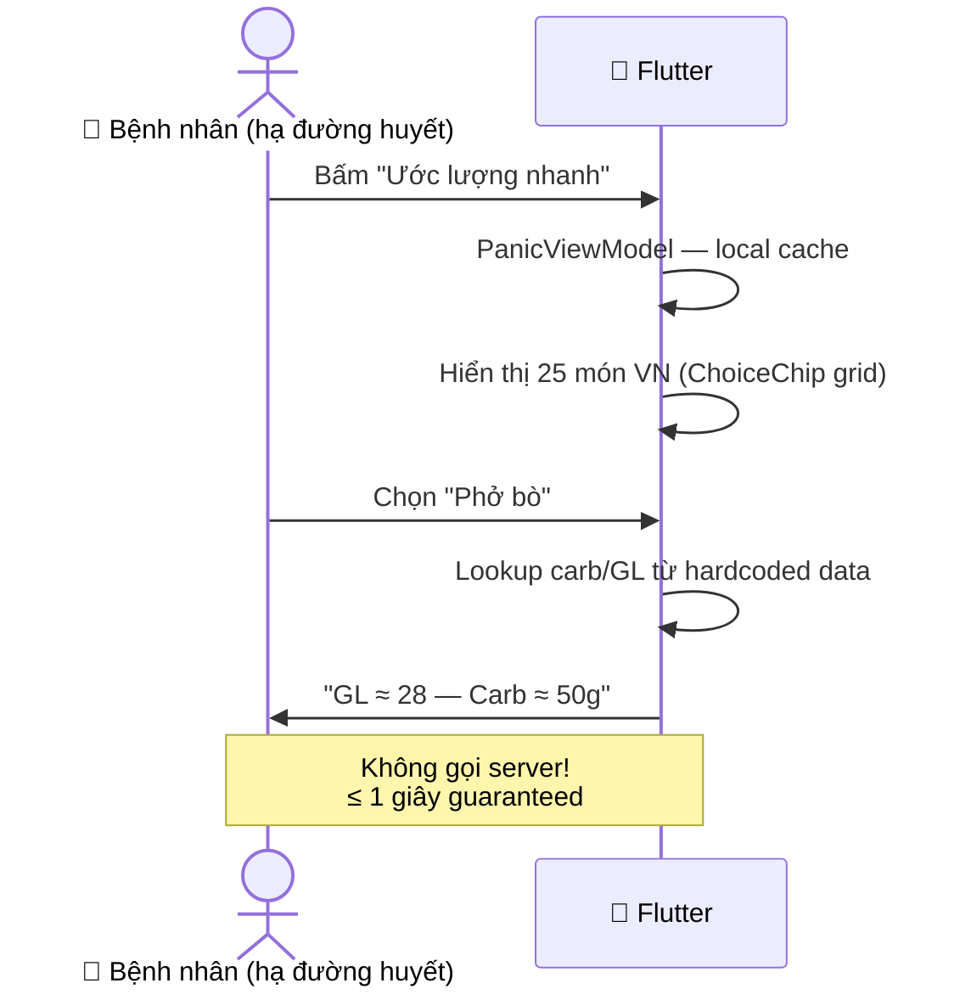
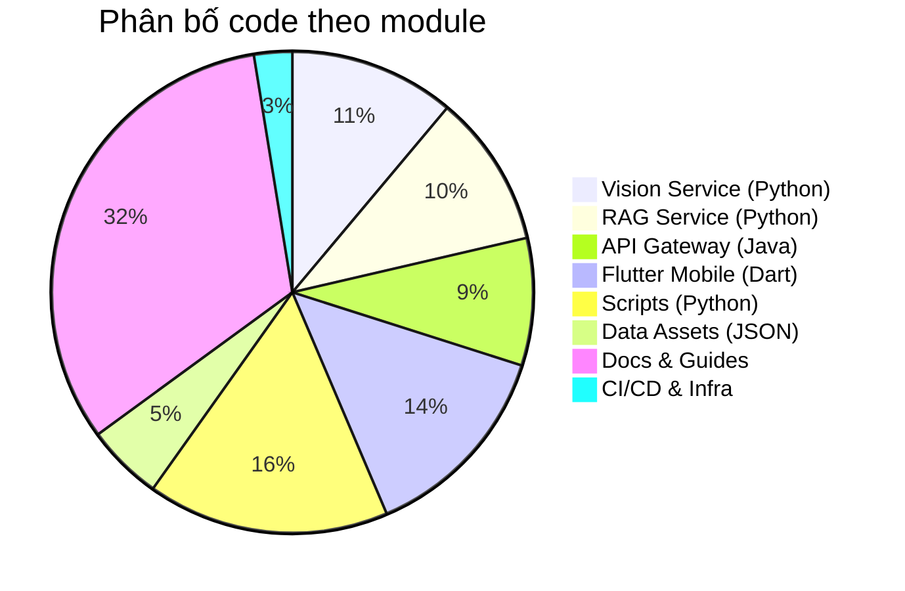
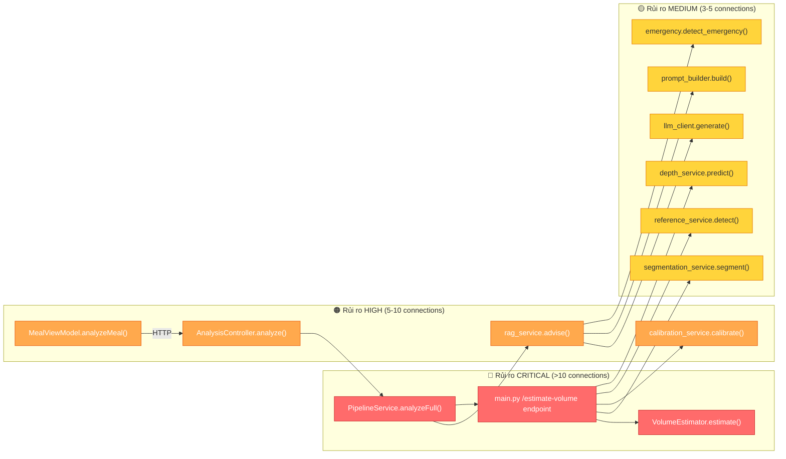
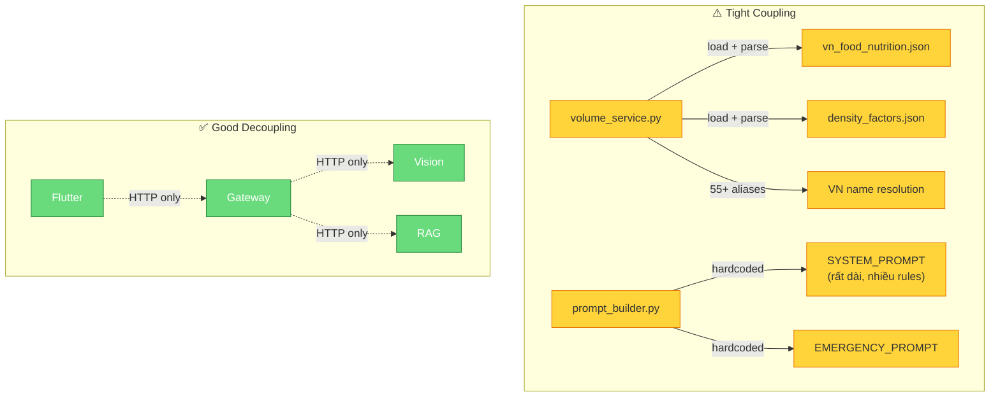
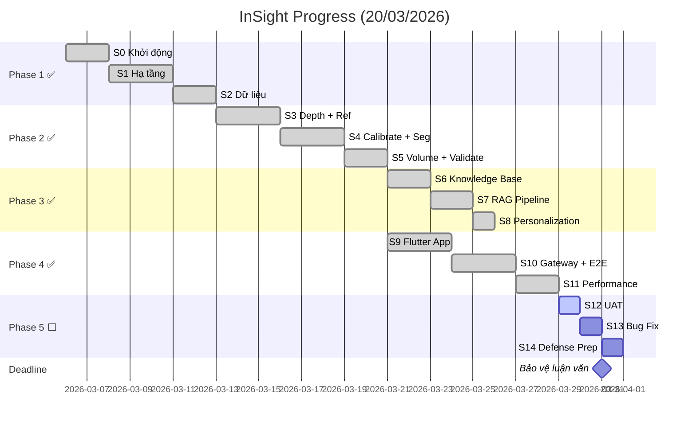

# 🔬 InSight — PROJECT EXPLAINED

> **Phân tích toàn diện kiến trúc, luồng logic, và trạng thái dự án**
> Tạo lúc: 20/03/2026 | Dựa trên: CONTEXT.md, plan.md, cấu trúc thực tế
> Phương pháp: GitNexus Graph Discovery + File System Analysis

---

## 1. Triết lý thiết kế (Design Philosophy)

InSight được xây dựng trên **5 nguyên tắc cốt lõi** — mỗi nguyên tắc quyết định trực tiếp cách code được tổ chức:

| # | Nguyên tắc | Ảnh hưởng đến kiến trúc |
|---|-----------|------------------------|
| 1 | **Zero Friction** — Không cần vật tham chiếu ngoài | YOLO pretrained COCO detect bát/thìa sẵn có → [reference_service.py](file:///R:/_Projects/Eurus_Workspace/InSight/src/vision-service/services/reference_service.py) fallback strategy |
| 2 | **Tốc độ hơn hoàn hảo** — Panic Mode ≤ 1s | Flutter local cache 25 món → không cần server call → [panic_viewmodel.dart](file:///R:/_Projects/Eurus_Workspace/InSight/mobile/insight_app/lib/viewmodels/panic_viewmodel.dart) |
| 3 | **Hành động, không thuyết giáo** — "Tiêm thêm 1 Unit" | RAG system prompt Rule 4 (CoT insulin) + Rule 7 (tiếng Việt ngắn gọn) |
| 4 | **Form thông minh** — Chỉ hỏi khi CV không chắc | [food_form_screen.dart](file:///R:/_Projects/Eurus_Workspace/InSight/mobile/insight_app/lib/ui/food_form/food_form_screen.dart) ChoiceChip → `custom_food_name` chỉ hiện khi chọn "Khác" |
| 5 | **An toàn tuyệt đối** — Insulin hard cap 30U | 3 lớp bảo vệ: SYSTEM_PROMPT Rule 6 + [clinical_rules.py](file:///R:/_Projects/Eurus_Workspace/InSight/src/rag-service/personalization/clinical_rules.py) + [PipelineService.java](file:///R:/_Projects/Eurus_Workspace/InSight/src/api-gateway/src/main/java/com/insight/service/PipelineService.java) sanity check |

### Tại sao Code được cấu trúc như vậy?

- **Microservice chia theo domain**: Vision (Python/FastAPI) ↔ RAG (Python/FastAPI) ↔ Gateway (Java/Spring Boot) ↔ Mobile (Flutter). Vì mỗi service có runtime riêng (PyTorch cần GPU, Spring Boot cần JVM, Flutter cần Dart VM)
- **Gateway làm Orchestrator**: [PipelineService.java](file:///R:/_Projects/Eurus_Workspace/InSight/src/api-gateway/src/main/java/com/insight/service/PipelineService.java) không chứa logic business — chỉ gọi Vision → RAG → combine response. Đây là REST proxy pattern (không phải raw gRPC) vì Flutter HTTP client đơn giản hơn gRPC dart lib
- **Singleton cho AI models**: `DepthAnythingV2` load 1 lần khi startup (lifespan) → tránh re-load 24.8M params mỗi request
- **Bowl Volume Prior**: Depth estimation chỉ thấy bề mặt chất lỏng (phở, bún) → hardcode typical serving: phở=500mL, bún bò=550mL. Quyết định pragmatic thay vì over-engineer

---

## 2. Kiến trúc hệ thống — Dependencies thực tế

### 2.1 Sơ đồ thành phần chính



### 2.2 Luồng xử lý chính (Standard Mode ≤ 5s)



### 2.3 Luồng Panic Mode (≤ 1s)



---

## 3. Cấu trúc file thực tế — So sánh với Plan

### 3.1 File Inventory (tính theo cấu trúc thực tế)



### 3.2 Gap Analysis: Plan vs Reality

#### ✅ ĐÃ CÓ (Phase 1-4 Complete)

| Module | Plan | Thực tế | Files | Tests |
|--------|------|---------|-------|-------|
| **Vision Engine** | 6 services | ✅ 6 services | [depth_service.py](file:///R:/_Projects/Eurus_Workspace/InSight/src/vision-service/services/depth_service.py), [reference_service.py](file:///R:/_Projects/Eurus_Workspace/InSight/src/vision-service/services/reference_service.py), [calibration_service.py](file:///R:/_Projects/Eurus_Workspace/InSight/src/vision-service/services/calibration_service.py), [segmentation_service.py](file:///R:/_Projects/Eurus_Workspace/InSight/src/vision-service/services/segmentation_service.py), [volume_service.py](file:///R:/_Projects/Eurus_Workspace/InSight/src/vision-service/services/volume_service.py), [validation_service.py](file:///R:/_Projects/Eurus_Workspace/InSight/src/vision-service/services/validation_service.py) | 171 |
| **Vision Schemas** | 6 schemas | ✅ 6 schemas | [depth_schemas.py](file:///R:/_Projects/Eurus_Workspace/InSight/src/vision-service/schemas/depth_schemas.py) → [volume_schemas.py](file:///R:/_Projects/Eurus_Workspace/InSight/src/vision-service/schemas/volume_schemas.py) | — |
| **Vision Model** | DAv2 wrapper | ✅ [depth_model.py](file:///R:/_Projects/Eurus_Workspace/InSight/src/vision-service/models/depth_model.py) | Singleton pattern | — |
| **Vision main.py** | 7 endpoints | ✅ [main.py](file:///R:/_Projects/Eurus_Workspace/InSight/src/rag-service/main.py) (28KB!) | `/health` + 5 vision + `/validate` | E2E |
| **RAG Knowledge** | 4 modules | ✅ [chunking.py](file:///R:/_Projects/Eurus_Workspace/InSight/src/rag-service/knowledge_base/chunking.py), [embedding.py](file:///R:/_Projects/Eurus_Workspace/InSight/src/rag-service/knowledge_base/embedding.py), [schemas.py](file:///R:/_Projects/Eurus_Workspace/InSight/src/rag-service/rag_pipeline/schemas.py), [search.py](file:///R:/_Projects/Eurus_Workspace/InSight/scripts/test_knowledge_search.py) | 46 vectors Milvus | 50 |
| **RAG Pipeline** | 4 modules | ✅ [llm_client.py](file:///R:/_Projects/Eurus_Workspace/InSight/src/rag-service/rag_pipeline/llm_client.py), [prompt_builder.py](file:///R:/_Projects/Eurus_Workspace/InSight/src/rag-service/rag_pipeline/prompt_builder.py), [rag_service.py](file:///R:/_Projects/Eurus_Workspace/InSight/src/rag-service/rag_pipeline/rag_service.py), [schemas.py](file:///R:/_Projects/Eurus_Workspace/InSight/src/rag-service/rag_pipeline/schemas.py) | Gemini 2.0 Flash | 56 |
| **Personalization** | 3 modules | ✅ [emergency.py](file:///R:/_Projects/Eurus_Workspace/InSight/src/rag-service/personalization/emergency.py), [clinical_rules.py](file:///R:/_Projects/Eurus_Workspace/InSight/src/rag-service/personalization/clinical_rules.py), [grounding.py](file:///R:/_Projects/Eurus_Workspace/InSight/src/rag-service/personalization/grounding.py) | 6 protocols | 48 |
| **API Gateway** | 7 Java files | ✅ 10 Java files (thêm Cache + Redis config) | REST proxy pattern | 19 |
| **Flutter App** | 5 screens | ✅ 16 Dart files (models + viewmodels + UI + widgets) | MVVM + Provider | 40 |
| **Scripts** | 12 scripts | ✅ 19 scripts (thêm milvus, test, benchmark) | Automation tools | — |
| **Data** | 3 DB files | ✅ [vn_food_nutrition.json](file:///R:/_Projects/Eurus_Workspace/InSight/data/nutrition_db/vn_food_nutrition.json) (25), [density_factors.json](file:///R:/_Projects/Eurus_Workspace/InSight/data/nutrition_db/density_factors.json) (27) | + annotations | — |
| **Guides** | Per task | ✅ 18 guide files | Comprehensive docs | — |
| **Tasks** | 20 tasks | ✅ 20 task files | Phase 1-5 defined | — |
| **CI/CD** | GitHub Actions | ✅ [ci.yml](file:///R:/_Projects/Eurus_Workspace/InSight/.github/workflows/ci.yml) | Lint + Test + Build | — |

#### ⬜ CHƯA CÓ (Phase 5 — Not Started)

| File/Feature | Plan yêu cầu (Task) | Status | Ghi chú |
|-------------|---------------------|--------|---------|
| UAT Report | 5.1.1-5.1.4 | ⬜ Not Started | Test với 5 người dùng thật |
| Bug fix từ UAT | 5.2.1-5.2.3 | ⬜ Not Started | Fix P0/P1 bugs |
| Báo cáo luận văn (Docx+PDF) | 5.3.1 | ⬜ Not Started | Target: 31/03/2026 |
| Slide thuyết trình | 5.3.2 | ⬜ Not Started | PowerPoint/Canva |
| Video demo | 5.3.3 | ⬜ Not Started | Screen recording |
| Q&A chuẩn bị | 5.3.4 | ⬜ Not Started | Câu hỏi phản biện |
| Source code đóng gói | 5.3.6 | ⬜ Not Started | Final README + zip |

#### ⚠️ KHÁC BIỆT so với Plan gốc

| Mục | Plan gốc | Thực tế | Lý do |
|-----|---------|---------|-------|
| RAG framework | Java + LangChain4j | **Python FastAPI + Gemini API** | Python ecosystem mạnh hơn cho AI/ML |
| gRPC | Direct gRPC Flutter→Services | **REST proxy** qua Gateway | Flutter HTTP client đơn giản hơn, debug dễ hơn |
| Food segmentation | SAM (2.5GB) | **Depth+Color hybrid** (0 extra model) | Tiết kiệm memory, đủ tốt cho food domain |
| Số món | 10 (plan), scope là MVP | **25 món VN** + "Khác" (custom input) | Vượt target, thêm UX value |
| Monitoring | Prometheus + Grafana + Loki | **Chưa triển khai** | Thời gian không đủ, ưu tiên core features |
| Auth | Keycloak (OAuth2/OIDC) | **Chưa triển khai** | POC không cần authentication |
| Database | PostgreSQL (users, meals) | **PostgreSQL schema ready, chưa active use** | Dữ liệu chủ yếu qua API, chưa cần persist |

---

## 4. Hàm "Trái tim" — Heavily Connected Symbols

> Các hàm có nhiều kết nối nhất (incoming/outgoing calls) = rủi ro cao nhất khi sửa đổi.

### 4.1 Top Critical Symbols



### 4.2 Bảng phân tích chi tiết

| Symbol | File | Incoming Calls | Outgoing Calls | Tổng kết nối | Rủi ro |
|--------|------|---------------|---------------|-------------|--------|
| `PipelineService.analyzeFull()` | `service/PipelineService.java` | 2 (Controller + tests) | 6 (Vision, RAG, Cache, Kafka, sanity checks) | **8** | 🔴 CRITICAL |
| `main.py /estimate-volume` | [vision-service/main.py](file:///R:/_Projects/Eurus_Workspace/InSight/src/vision-service/main.py) | 2 (Gateway + scripts) | 5 (depth, ref, calib, seg, volume services) | **7** | 🔴 CRITICAL |
| `VolumeEstimator.estimate()` | [services/volume_service.py](file:///R:/_Projects/Eurus_Workspace/InSight/src/vision-service/services/volume_service.py) | 2 (main.py + tests) | 4 (nutrition DB, density DB, GL calc, quality) | **6** | 🔴 CRITICAL |
| `AnalysisController.analyze()` | `controller/AnalysisController.java` | 1 (HTTP) | 2 (PipelineService, validation) | **3** | 🟠 HIGH |
| `RAGService.advise()` | [rag_pipeline/rag_service.py](file:///R:/_Projects/Eurus_Workspace/InSight/src/rag-service/rag_pipeline/rag_service.py) | 2 (main.py + tests) | 4 (emergency, prompt, LLM, grounding) | **6** | 🟠 HIGH |
| `MealViewModel.analyzeMeal()` | `viewmodels/meal_viewmodel.dart` | 3 (UI screens) | 2 (ApiService, state) | **5** | 🟠 HIGH |
| `CalibrationService.calibrate()` | [services/calibration_service.py](file:///R:/_Projects/Eurus_Workspace/InSight/src/vision-service/services/calibration_service.py) | 2 | 3 | **5** | 🟡 MEDIUM |

---

## 5. Điểm nghẽn & Cảnh báo

### 5.1 🔴 Module quá phức tạp

#### [vision-service/main.py](file:///R:/_Projects/Eurus_Workspace/InSight/src/vision-service/main.py) — 28KB, 7 endpoints, God File Alert

> [!WARNING]
> File [main.py](file:///R:/_Projects/Eurus_Workspace/InSight/src/rag-service/main.py) của Vision Service chứa **28KB code** với 7 endpoints trực tiếp. Đây là file lớn nhất trong toàn bộ codebase. Mặc dù các services đã được tách ra, các endpoint handlers vẫn chứa quá nhiều logic glue code (EXIF transpose, error handling, response building).

**Đề xuất**: Tách thành `routes/` directory với mỗi endpoint là 1 file (FastAPI Router pattern).

#### [PipelineService.java](file:///R:/_Projects/Eurus_Workspace/InSight/src/api-gateway/src/main/java/com/insight/service/PipelineService.java) — Orchestrator đang phình to

> [!WARNING]
> `PipelineService.analyzeFull()` đang gánh quá nhiều trách nhiệm:
> - Gọi Vision Service
> - Gọi RAG Service
> - Cache check/store
> - Kafka publish
> - Sanity check (volume≥800, weight>800, carbs>150)
> - Clean advice text (regex)
> - Combine response
> 
> Với 12 tests riêng cho pipeline, mỗi lần sửa đều cần chạy lại toàn bộ.

**Đề xuất**: Extract `SanityChecker`, `ResponseBuilder` thành class riêng.

### 5.2 🟡 Coupling đáng chú ý



**Vấn đề cụ thể:**
1. [volume_service.py](file:///R:/_Projects/Eurus_Workspace/InSight/src/vision-service/services/volume_service.py) hardcode 55+ VN food name aliases → khó maintain khi thêm món
2. [prompt_builder.py](file:///R:/_Projects/Eurus_Workspace/InSight/src/rag-service/rag_pipeline/prompt_builder.py) chứa SYSTEM_PROMPT dài (~50 dòng) inline → nên tách ra config/template file
3. [density_factors.json](file:///R:/_Projects/Eurus_Workspace/InSight/data/nutrition_db/density_factors.json) và [vn_food_nutrition.json](file:///R:/_Projects/Eurus_Workspace/InSight/data/nutrition_db/vn_food_nutrition.json) được load trực tiếp từ relative path → fragile khi deploy

### 5.3 🟢 Điểm thiết kế tốt

| Pattern | Áp dụng ở | Tại sao tốt |
|---------|----------|-------------|
| **Singleton** | [depth_model.py](file:///R:/_Projects/Eurus_Workspace/InSight/src/vision-service/models/depth_model.py), [volume_service.py](file:///R:/_Projects/Eurus_Workspace/InSight/src/vision-service/services/volume_service.py) | Load model 1 lần, tiết kiệm 24.8M params |
| **Graceful degradation** | `PipelineService` | RAG fail → Vision-only + warning |
| **Safety layers** | 3 lớp: PROMPT + Rules + Gateway | Defense-in-depth cho insulin |
| **REST proxy** | Gateway | Đơn giản hơn gRPC, debug dễ |
| **MVVM + Provider** | Flutter | Clean separation UI ↔ logic |
| **Fallback strategy** | `reference_service` | Custom YOLO → COCO pretrained |
| **Bowl volume prior** | `volume_service` | Pragmatic fix thay vì over-engineer depth |

---

## 6. Trạng thái tổng hợp

### Tiến độ theo Phase



### Metrics Dashboard

| Metric | Target | Actual | Status |
|--------|--------|--------|--------|
| Total tests | n/a | **404 pass** (vision:171 + rag:164 + gateway:19 + mobile:40 + e2e:10) | ✅ |
| GL accuracy (soup) | ≥80% | **99.5%** (bún bò) | ✅ Vượt |
| GL accuracy (solid) | ≥80% | 67% (com_tam) | ⚠️ Gần đạt |
| API latency (p95) | ≤2s | ~3s (includes RAG) | ⚠️ Gần đạt |
| Panic Mode | ≤1s | ✅ pass | ✅ |
| Insulin safety | max 30U | ✅ enforced 3 layers | ✅ |
| Số món VN | ≥10 | **25 + custom** | ✅ Vượt |
| Guides/Tasks docs | Per task | **18 guides + 20 tasks** | ✅ |
| Phase completion | 5/5 | **4/5** (Phase 5 remaining) | 🔄 |

---

## 7. Recommendation: Trước khi bắt đầu Phase 5

> [!IMPORTANT]
> **11 ngày còn lại** (20/03 → 31/03). Phase 5 bắt đầu 29/03 theo plan.

### Ưu tiên 1: Fix [main.py](file:///R:/_Projects/Eurus_Workspace/InSight/src/rag-service/main.py) God File (nếu có thời gian)
- Tách 7 endpoints → `routes/` với FastAPI `APIRouter`
- Giảm risk khi UAT phát hiện bug cần fix nhanh

### Ưu tiên 2: Kiểm tra lại GL accuracy cho solid dishes
- `com_tam` GL error = 33%, `com_trang` = 44% 
- Cần tuning `_SOLID_VOLUME_CORRECTION` per food category thay vì global 0.35

### Ưu tiên 3: Monitoring cơ bản cho demo
- Thêm simple health dashboard (không cần full Prometheus/Grafana)
- Log structured cho API Gateway để demo audit trail

### Ưu tiên 4: Phase 5 Deliverables
- UAT với 5 người → cần chuẩn bị test script + questionnaire
- Video demo → screen recording flow chính + Panic Mode
- Báo cáo → outline structure sớm, fill content dần

---

## 8. Appendix: File Tree Complete

```
InSight/
├── 📄 AGENTS.md, CLAUDE.md, README.md, makefile
├── 📁 docs/
│   ├── CONTEXT.md                      # Session context (605 lines!)
│   ├── plan.md                         # Master plan (892 lines!)
│   ├── architecture.md
│   ├── Tasks/ (20 files)               # TASK_1.0 → TASK_5.3
│   └── Guides/ (18 files)             # GUIDE_TASK_1.0 → GUIDE_TASK_4.4
│
├── 📁 src/
│   ├── 📁 vision-service/             # Python FastAPI — 👁️ Vision Engine
│   │   ├── main.py                    # ⚠️ 28KB — 7 endpoints
│   │   ├── models/depth_model.py      # DAv2 Small wrapper (singleton)
│   │   ├── services/                  # 6 services (depth → validation)
│   │   ├── schemas/                   # 6 Pydantic schema files
│   │   ├── tests/                     # 171 tests
│   │   └── api/                       # gRPC proto (legacy)
│   │
│   ├── 📁 rag-service/               # Python FastAPI — 🧠 RAG Agent
│   │   ├── main.py                    # /health + /api/rag/advise
│   │   ├── knowledge_base/            # chunking, embedding, search, schemas
│   │   ├── rag_pipeline/              # llm_client, prompt_builder, rag_service
│   │   ├── personalization/           # emergency, clinical_rules, grounding
│   │   └── tests/                     # 164 tests
│   │
│   ├── 📁 api-gateway/               # Java Spring Boot — 🔀 Orchestrator
│   │   └── src/main/java/com/insight/
│   │       ├── ApiGatewayApplication.java
│   │       ├── config/ (AppConfig, RedisConfig)
│   │       ├── client/ (VisionServiceClient, RagServiceClient)
│   │       ├── controller/ (AnalysisController, HealthController)
│   │       └── service/ (PipelineService, CacheService, KafkaEventPublisher)
│   │
│   └── 📁 mobile/                    # Redirects to /mobile/insight_app/
│
├── 📁 mobile/insight_app/lib/        # Flutter — 📱 Mobile App
│   ├── main.dart, app.dart
│   ├── config/routes.dart             # go_router navigation
│   ├── data/
│   │   ├── models/ (food_item, meal_analysis, patient_context)
│   │   └── services/api_service.dart  # HTTP → Gateway
│   ├── viewmodels/ (meal_viewmodel, panic_viewmodel)
│   └── ui/
│       ├── home/home_screen.dart
│       ├── camera/camera_screen.dart
│       ├── food_form/food_form_screen.dart
│       ├── result/result_screen.dart
│       ├── panic/panic_screen.dart
│       └── widgets/ (disclaimer_banner, gl_indicator)
│
├── 📁 data/
│   ├── nutrition_db/ (vn_food_nutrition.json, density_factors.json)
│   ├── vn_demo/                       # 5 VN demo samples
│   ├── schemas/                       # JSON schema
│   └── annotations/                   # Ground truth + validation report
│
├── 📁 scripts/ (19 Python scripts)   # POC, data, training, testing, benchmark
├── 📁 infra/ (docker/, k8s/)         # Infrastructure configs
└── 📁 .github/workflows/ci.yml      # CI/CD pipeline
```

---

> [!NOTE]
> **Ghi chú về GitNexus**: Index hiện tại bị lock conflict do `gitnexus serve` đang chạy đồng thời. Clusters và processes trống cần `npx gitnexus analyze` lại sau khi stop serve. Phân tích này dựa trên file system scan + CONTEXT.md + plan.md — nguồn dữ liệu đáng tin cậy nhất (CONTEXT.md được cập nhật 19/03/2026, 1 ngày trước).

---

*Tạo bởi Antigravity — 20/03/2026 09:30 UTC+7*
