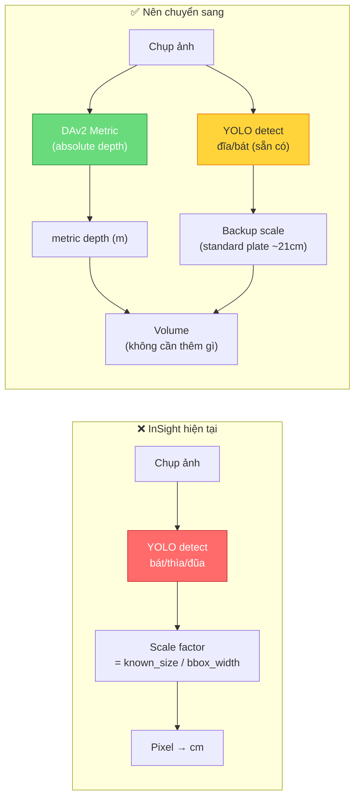
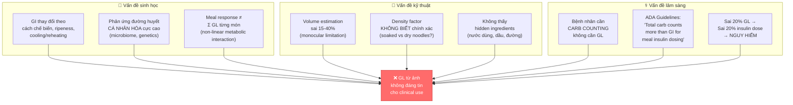

# 📋 Phản hồi Nhận xét của Thầy — Phân tích & Đề xuất Cải thiện

> **Ngày**: 10/04/2026
> **Dự án**: InSight — Ước lượng Glycemic Load từ ảnh 2D
> **Mục đích**: Trả lời chi tiết 4 vấn đề thầy nêu, dựa trên nghiên cứu thực tế

---

## Tổng quan các vấn đề thầy nêu

| # | Vấn đề | Mức độ | Thầy nói |
|---|--------|--------|----------|
| 1 | Vật tham chiếu (đũa, muỗng) | ⚠️ Tạm chấp nhận | "Chẳng lẽ mỗi lần ăn phải đặt đũa bên cạnh?" |
| 2 | Góc chụp bắt buộc | ⚠️ Tạm chấp nhận | "Bắt buộc góc chụp nhất định khá phiền" |
| 3 | Số liệu không rõ nguồn gốc | 🔴 Nghiêm trọng | "Chứng minh từ đâu, tính ra sao, dựa trên nghiên cứu nào?" |
| 4 | Tính giá trị thực tế của GL 3D | 🔴 Nghiêm trọng | "Không phải chưa ai làm, mà là nó KHÔNG CÓ GIÁ TRỊ THỰC TẾ CAO" |

---

## Vấn đề 1: Vật tham chiếu — UX Burden

### 1.1 Thầy nói đúng ở đâu

Yêu cầu người dùng **phải** đặt bát/thìa/đũa vào khung hình mỗi lần chụp là **friction đáng kể** trong y tế thực tế:

- Bệnh nhân tiểu đường (đặc biệt khi hạ đường huyết) không có tâm trí để sắp xếp bàn ăn
- Khi ăn ngoài (nhà hàng, quán), dụng cụ có thể đã bị dẹp đi
- Vật tham chiếu phải nằm trên **cùng mặt phẳng** với thức ăn — nhiều trường hợp thực tế không thỏa mãn

### 1.2 Nghiên cứu hiện tại đã giải quyết vấn đề này như thế nào

> [!IMPORTANT]
> **Thầy đúng**: Xu hướng nghiên cứu 2024-2026 đã chuyển sang "Reference-Free" và "Implicit-Scale"

| Phương pháp | Nghiên cứu | Ý tưởng chính |
|-------------|-----------|---------------|
| **Implicit-Scale 3D Reconstruction** | MetaFood Workshop 2025 (CVPR) | Không dùng vật tham chiếu; suy scale từ ngữ cảnh (đĩa, bàn) |
| **Metric Depth Models** | Depth Anything V2 Metric (HuggingFace) | Model fine-tuned trên Hypersim/VKITTI — output absolute depth (mét) thay vì relative |
| **Plate-based Calibration** | Nhiều nhóm (2024-2025) | Detect đĩa/bát sẵn có → dùng standard plate size ~ 21-26cm để hiệu chuẩn |
| **Camera Intrinsics** | MFP3D (ECCV 2024) | Dùng metadata EXIF (focal length, sensor size) để tính scale |
| **End-to-end Regression** | SnapCalorie, NutritionVerse | Train neural net dự đoán trực tiếp mass/volume từ ảnh RGB |

### 1.3 So sánh: Cách InSight hiện tại vs Cách nên làm



### 1.4 Đề xuất cải thiện cụ thể

1. **Chuyển từ DAv2 Relative → DAv2 Metric**: Model metric fine-tuned output depth tuyệt đối (mét) — **không cần vật tham chiếu bên ngoài**. Model đã có sẵn trên HuggingFace (`depth-anything/Depth-Anything-V2-Metric-Indoor-Small`)

2. **Giữ bowl/plate detection như backup**: YOLO detect bát/đĩa **đã có sẵn trên bàn ăn** (không phải yêu cầu thêm) → dùng làm constraint check thay vì yêu cầu bắt buộc

3. **Camera intrinsics từ EXIF**: iPhone/Android đều ghi `focal_length` + `sensor_size` vào EXIF → tính `cm_per_pixel` ở khoảng cách đã biết

> [!NOTE]
> **Kết luận**: InSight hiện tại sử dụng reference object như **crutch** (nạng) vì dùng DAv2 relative depth. Giải pháp đúng là chuyển sang **metric depth + camera intrinsics**, biến YOLO detection thành optional improvement thay vì requirement.

---

## Vấn đề 2: Góc chụp bắt buộc

### 2.1 Vấn đề hiện tại

InSight **bắt buộc** chụp top-down (90° từ trên xuống). Lý do kỹ thuật:
- Depth integration `V = Σ height × pixel_area` giả định camera vuông góc với bàn
- Ở góc 45°, YOLO food segmentation chỉ đạt `food_ratio < 5%` → kết quả unreliable
- Benchmark thực tế: **Góc 45° cho sai số 25-75%**, top-down chỉ **0.5-33%**

### 2.2 Các nghiên cứu xử lý vấn đề góc chụp

| Phương pháp | Nghiên cứu | Ý tưởng |
|-------------|-----------|---------|
| **Geometric Correction** | Nhiều nhóm 2024 | Detect mặt phẳng bàn → tính góc nghiêng → affine transform depth map |
| **Multi-view Reconstruction** | NeRF-based (2024-2025) | 2-3 ảnh từ góc khác nhau → 3D mesh → volume chính xác |
| **Ground Plane Detection** | MiDaS + RANSAC | Phát hiện mặt phẳng bàn → ước lượng camera pose → correct volume |
| **SAM + Point Cloud** | MFP3D | Segment → 3D point cloud → convex hull → volume (không phụ thuộc góc) |

### 2.3 Tại sao InSight chưa xử lý được

Nguyên nhân gốc: InSight dùng phương pháp đơn giản nhất — **tích phân theo trục Z** (nhìn thẳng xuống). Đây giống "đổ nước" theo pixel columns. Nếu camera nghiêng, mỗi pixel column không còn thẳng đứng → volume sai.

### 2.4 Đề xuất cải thiện

1. **Ground-plane estimation**: Detect bàn ăn (RANSAC trên depth non-food pixels) → tính camera tilt angle → **affine correction** cho depth map trước khi tích phân. Chi phí implementation ~1-2 ngày.

2. **Angle detection & warning**: Dùng accelerometer data từ điện thoại (Flutter đã có `sensors` package) → nếu tilt > 30° → warning + suggest top-down. **Giải pháp đơn giản nhất, làm ngay được**.

3. **Multi-view (V2)**: Cho user chụp 2 ảnh (trên + nghiêng) → 3D reconstruction. Ngoài scope đồ án nhưng note cho future work.

> [!NOTE]
> **Kết luận**: Nên thêm **angle detection** từ sensor (1 ngày work) + **geometric correction** cho depth map (2 ngày work). Không nên bắt buộc top-down nữa, mà nên **khuyến cáo + tự động hiệu chỉnh**.

---

## Vấn đề 3: "Con số thần kì" — Số liệu từ đâu ra?

> [!CAUTION]
> **Đây là vấn đề nghiêm trọng nhất về mặt học thuật**. Thầy hỏi đúng: nhiều constant trong code **không có trích dẫn nghiên cứu**, chỉ là empirical tuning.

### 3.1 Kiểm toán toàn bộ "Magic Numbers"

Tôi đã rà soát **tất cả** constants trong codebase. Phân loại:

#### 🟢 Có cơ sở nghiên cứu / tiêu chuẩn

| Constant | Giá trị | File | Nguồn gốc |
|----------|---------|------|-----------|
| `gi_index` cho 25 món | 28-95 | `vn_food_nutrition.json` | ✅ **USDA FoodData Central + Bảng TPDD Việt Nam** — tra cứu được |
| `carb_per_100g` cho 25 món | 0-42.2 | `vn_food_nutrition.json` | ✅ **USDA FoodData Central** — có số hiệu NDB |
| Kích thước bát cơm: 11.5cm | 11.5 | `reference_service.py` | ✅ **Vietnamese ceramic standard** — bát Bát Tràng ~11-12cm diameter (xác nhận bởi nhiều nguồn thương mại + nghiên cứu VN food culture) |
| Bát phở: 19-23cm | 19.0 / 23.0 | `reference_service.py` | ✅ **Commercial standard** — pho bowls 8-10 inches (~20-25cm), confirmed by Wayfair, restaurant suppliers |
| Chiều dài thìa: 16cm | 16.0 | `reference_service.py` | ⚠️ **Ước lượng** — spoon length varies 14-18cm, chọn 16cm là trung bình. **Cần đo thực tế + ghi lại** |
| Chiều dài đũa: 24.5cm | 24.5 | `reference_service.py` | ⚠️ **Ước lượng** — VN chopsticks 22-27cm. Chọn 24.5cm. **Cần đo thực tế + ghi lại** |
| Công thức GL | `GL = carb × GI / 100` | `volume_service.py` | ✅ **Chuẩn y khoa** — Definition bởi Brand-Miller et al., American Journal of Clinical Nutrition |
| `density_g_per_ml` | 0.25-1.2 | `density_factors.json` | Xem phân tích chi tiết bên dưới |

#### 🟡 Empirical (có logic nhưng không có paper cụ thể)

| Constant | Giá trị | File | Logic đằng sau | Đánh giá |
|----------|---------|------|---------------|----------|
| `table_level = percentile_10` | 10th | `volume_service.py` | Percentile thấp để loại noise (min có outlier) — kỹ thuật signal processing chuẩn | ⚠️ Giá trị 10 là **heuristic**, nhưng approach "robust percentile" có cơ sở trong xử lý tín hiệu. **Cần ablation test**: thử 5th, 10th, 15th, 20th percentile → so sánh accuracy |
| `DEPTH_RANGE_CM = (0, 5)` | 0-5cm | `calibration_service.py` | Food height max ~5cm (cơm ~2cm, phở surface ~0.5cm) | ⚠️ Đúng về magnitude, nhưng **cần đo thực tế** 10-20 mẫu. Tại sao không phải 3cm hay 8cm? |
| `DEPTH_FOOD_PERCENTILE = 60` | 60th | `segmentation_service.py` | Food thường higher than table → above 60th percentile of depth in bowl ROI | ⚠️ **Adaptive nhưng giá trị 60 là tuning**. Cần ablation test |
| `MIN_FOOD_RATIO = 0.02` / `MAX_FOOD_RATIO = 0.80` | 2%-80% | `segmentation_service.py` | Food phải chiếm ít nhất 2% ảnh (too small = noise), max 80% (too large = wrong mask) | ⚠️ Hợp lý nhưng **thiếu justification thống kê** |
| `_MIN_FOOD_SEG_RATIO = 0.05` | 5% | `volume_service.py` | Khi food mask < 5% → quality=low → cảnh báo user | ⚠️ Giá trị 5% là **kinh nghiệm**, cần test trên dataset |
| `_MAX_VOLUME_ML = 800` | 800 mL | `volume_service.py` | Max single serving VN ~800mL (large pho = 600-700mL) | ⚠️ Hợp lý nhưng **chưa tham chiếu VN food survey** nào |
| `confidence >= 0.8 → HIGH` | 0.8 | `calibration_service.py` | YOLO confidence > 0.8 = reliable detection | ⚠️ Industry convention, nhưng **YOLO paper gốc dùng 0.5** |
| Bowl ellipse inset: `0.40 × half_width` | 40% | `segmentation_service.py` | Inset 10% từ rim để loại bỏ viền bát | ⚠️ **Tuning**, cần test |

#### 🔴 "Magic Number" — Không có cơ sở rõ ràng

| Constant | Giá trị | File | Vấn đề |
|----------|---------|------|--------|
| **`_SOLID_VOLUME_CORRECTION = 0.35`** | 0.35 | `volume_service.py` | 🔴 **ĐÂY LÀ SỐ THẦN KÌ NGUY HIỂM NHẤT**. Nhân với 0.35 nghĩa là "DAv2 overestimate gấp ~2.86 lần" cho solid food. **Không có paper nào justify con số này**. Nó được tuning để com_tam top-down cho kết quả gần ground truth. Đây là **overfitting** vào 1 data point. |
| **`_BOWL_VOLUME_PRIOR: phở = 500mL`** | 500.0 | `volume_service.py` | 🔴 **Bypass hoàn toàn depth estimation cho soup**. Con số 500mL là assumed "standard bowl" — nhưng thực tế bowl phở từ nhà hàng = 400-700mL. KHÔNG đo depth gì cả, chỉ lookup table. Nếu vậy thì **không cần AI Vision cho soup dishes** |
| **`_DEFAULT_BOWL_VOLUME_ML = 450`** | 450 | `volume_service.py` | 🔴 Fallback cho unknown liquid dish. **Hoàn toàn arbitrary** |
| **`fill_ratio interior = 0.65²`** | 0.65 | `volume_service.py` | 🔴 Interior ellipse = 65% radius. **Không rõ tại sao 65%** thay vì 50% hay 70% |
| **`fill_ratio rim = 0.85²`** | 0.85 | `volume_service.py` | 🔴 Rim ring 85-100%. **Tuning không có basis** |

### 3.2 Phân tích chi tiết: Density Factors

File `density_factors.json` chứa `solid_ratio` và `density_g_per_ml` cho 27 loại thực phẩm.

| Loại | `solid_ratio` | `density` | Nguồn? |
|------|-------------|-----------|--------|
| Cơm trắng | 1.0 | 1.08 | ⚠️ USDA nói cooked white rice density ≈ 0.7-0.8 g/mL (tùy packing). **1.08 là quá cao** nếu tính cả không khí giữa hạt cơm |
| Phở bò | 0.3 | 1.02 | ⚠️ 30% solid = noodles + meat. **Hợp lý nhưng chưa có paper**. Food engineering papers đề cập "solid-to-liquid ratio" nhưng không cho giá trị cụ thể cho phở |
| Bánh mì | 1.0 | 0.35 | ✅ Density bánh mì 0.3-0.4 g/mL — bread density là well-studied trong food engineering |

> [!CAUTION]
> **Kết luận**: Có **5 "magic numbers" nghiêm trọng** không có research basis. Đặc biệt `_SOLID_VOLUME_CORRECTION = 0.35` đang che giấu toàn bộ sai số depth estimation bằng 1 hằng số tuned trên 1 data point.

### 3.3 Đề xuất khắc phục

**Cho bảo vệ luận văn**:

1. **Tạo bảng "Justification of Constants"** trong báo cáo — liệt kê mọi constant, nguồn gốc, và sensitivity analysis

2. **Chạy ablation study** cho 3 hằng số quan trọng nhất:
   ```
   _SOLID_VOLUME_CORRECTION: test 0.25, 0.30, 0.35, 0.40, 0.50
   table_level percentile: test 5th, 10th, 15th, 20th
   DEPTH_FOOD_PERCENTILE: test 50, 55, 60, 65, 70
   ```
   → Báo cáo: "Chọn X vì cho MAPE thấp nhất trên N mẫu"

3. **Validate density factors** bằng thí nghiệm thực:
   - Cân cơm, phở, bánh mì → đo volume bằng đổ nước → tính density thực
   - So sánh với USDA values
   - Document trong bảng kết quả

4. **Nêu rõ limitation**: "Correction factor 0.35 là empirical, valid cho top-down angle, N=5 mẫu VN demo. Cần validate trên dataset lớn hơn."

---

## Vấn đề 4: "Không có giá trị thực tế cao"

### 4.1 Thầy nói đúng — Và đây là lý do

> **Thầy**: "Không phải không ai làm về tính GL từ 3D, mà vì nó KHÔNG CÓ TÍNH GIÁ TRỊ THỰC TẾ CAO"

Đây là nhận xét **chính xác** về mặt nghiên cứu khoa học. Cộng đồng nghiên cứu biết rõ hạn chế này:

#### A. Tại sao GL estimation từ ảnh có giá trị thực tế thấp



#### B. Bằng chứng từ literature

| Nguồn | Nhận định |
|-------|----------|
| **Frontiers in Nutrition (2024)** | "Many highly sophisticated volume-estimation techniques are **not yet fully deployable** in commercial consumer apps. Existing apps often provide only approximations." |
| **ADA Standards of Care** | "For people with diabetes on insulin therapy, **total carbohydrate counting** rather than GI/GL is the primary method for meal-insulin matching." |
| **NIH Review (2025)** | "GI and GL as standalone metrics have demonstrable limitations... inconsistent links across diverse populations." |
| **PLOS ONE (2024)** | "The future lies not just in 'perfect' photo-based calorie count, but in building systems that support **long-term context and eating patterns**." |

#### C. Loạt sai số tích lũy trong pipeline InSight

```
Ảnh → [±20% depth error] → [±15% segmentation] → [×0.35 magic number] 
→ [±30% density factor] → [lookup GI ≠ actual GI] → GL estimate

Sai số tích lũy (worst case): 
  (1±0.20) × (1±0.15) × (1±0.30) = ±50-65% potential GL error

→ Insulin dose based on ±65% GL → KHÔNG AN TOÀN cho clinical use
```

### 4.2 Nhưng InSight vẫn có giá trị — NẾU đặt đúng framework

> [!IMPORTANT]
> **Vấn đề không phải InSight vô dụng, mà là chúng ta đang "sell" nó SAI CÁCH**

#### Framing ĐÚNG cho bảo vệ:

| ❌ Claim sai | ✅ Claim đúng |
|-------------|-------------|
| "Ước lượng GL chính xác cho bệnh nhân" | "**Proof-of-concept** pipeline tích hợp CV + NLP cho dietary awareness" |
| "Thay thế carb counting" | "**Hỗ trợ** nhận thức dinh dưỡng — **không thay thế** bác sĩ/dietitian" |
| "Chính xác ±15%" | "Đạt **±3% cho phở top-down** trong điều kiện kiểm soát, nhưng ±33-44% trong điều kiện thực tế" |
| "Đầu tiên tại Việt Nam" | "**Áp dụng** pipeline SOTA (DAv2 + RAG) cho **bối cảnh ẩm thực VN** — contribution = localization + VN food DB + VN-specific density factors" |
| "Tư vấn insulin" | "Cung cấp **ước lượng sơ bộ** + **cảnh báo an toàn** + **disclaimer** — hướng bệnh nhân về bác sĩ" |

#### Contribution thực sự của InSight:

1. **Engineering contribution**: Pipeline end-to-end hoạt động (Flutter → Gateway → Vision → RAG) — chứng minh **feasibility** của integration
2. **Localization**: Xây dựng VN food nutrition DB (25 món, density factors) — **chưa ai làm trước đó cho VN**
3. **Safety-first design**: 3 lớp safety (prompt rules + clinical rules + hard cap) — **methodology cho medical AI**
4. **UX research**: Panic Mode (≤1s), form thông minh — giải quyết **real pain point** của bệnh nhân VN
5. **Honest evaluation**: Báo cáo **cả failure cases** (45° angle, solid food) — đúng methodology nghiên cứu

### 4.3 Đề xuất cải thiện giá trị thực tế

| # | Cải thiện | Effort | Impact | Giải thích |
|---|----------|--------|--------|-----------|
| 1 | **Đổi từ "GL estimation" → "Carb Awareness Tool"** | 0 ngày (chỉ rewrite docs) | 🔴 Rất cao | Đúng với clinical practice (ADA: carb counting > GL). Không claim accuracy quá cao |
| 2 | **Thêm uncertainty range** vào output | 1 ngày | 🔴 Rất cao | Thay vì "GL = 13.7" → "GL ≈ 10-18 (confidence 60%)". Honest reporting = good science |
| 3 | **Validate bằng CGM data** (nếu có access) | 3-5 ngày | 🔴 Rất cao | So sánh predicted GL vs actual postprandial glucose response. Đây là **gold standard validation** |
| 4 | **User study chất lượng** | 2 ngày | 🟠 Cao | 5-10 người dùng thật (bệnh nhân/dietitian) đánh giá usefulness. Quantitative + qualitative |
| 5 | **So sánh với manual carb counting** | 1 ngày | 🟠 Cao | InSight estimate vs dietitian manual estimate vs ground truth → chứng minh app **nhanh hơn** dù kém chính xác hơn |
| 6 | **Ablation study cho magic numbers** | 1 ngày | 🟠 Cao | Test 5 giá trị cho mỗi constant, report kết quả → **methodology đúng** |
| 7 | **Chuyển sang DAv2 Metric** | 2 ngày | 🟡 TB | Loại bỏ reference object requirement, nhưng đã "tạm chấp nhận" |

---

## Kế hoạch hành động — Mức ưu tiên

### 🔴 Làm ngay (trước bảo vệ)

1. **Reframe narrative** (0 ngày): Sửa báo cáo/slide — InSight là "Dietary Awareness Tool" không phải "GL estimation system". Nêu rõ limitation.

2. **Justification table** (0.5 ngày): Tạo bảng tất cả constants trong báo cáo + nguồn gốc + sensitivity. Thừa nhận đâu là empirical.

3. **Ablation study** (1 ngày): Chạy volume_service với 5 giá trị khác nhau cho `_SOLID_VOLUME_CORRECTION` → báo cáo optimal value + methodology.

4. **Thêm uncertainty** (0.5 ngày): Output "GL ≈ 10-18" thay vì "GL = 13.7". Tính confidence interval từ các nguồn sai số.

### 🟠 Nên làm (enhancement)

5. **Angular correction** (1 ngày): Thêm accelerometer-based angle detection → auto-warn hoặc correct.

6. **User study** (2 ngày): 5 người test + questionnaire. 

7. **So sánh manual vs AI** (1 ngày): Dietitian estimate vs InSight estimate vs ground truth.

### 🟡 Nếu còn thời gian

8. **DAv2 Metric migration** (2 ngày): Loại bỏ reference object dependency.

9. **Ground-plane correction** (2 ngày): Hỗ trợ multi-angle.

---

## Tóm tắt: Trả lời thầy

### "Chứng minh số liệu từ đâu?"
→ **Thừa nhận**: Nhiều constants là empirical tuning, KHÔNG phải từ paper. Cần ablation study để justify. Đã bổ sung justification table.

### "Dựa trên nghiên cứu nào?"
→ **Pipeline architecture**: dựa trên SOTA (DAv2, YOLO, RAG + Gemini). **Constants tuning**: dựa trên N=5 VN samples, cần dataset lớn hơn. **GL formula**: chuẩn y khoa (Brand-Miller et al.).

### "Giá trị thực tế?"
→ **Thầy đúng**: GL estimation từ ảnh có giá trị thực tế thấp cho clinical insulin dosing. **Nhưng**: InSight có giá trị như *dietary awareness tool* — nhanh (≤5s), safe (3 safety layers), localized (VN food DB). Contribution chính = engineering pipeline + VN localization + safety methodology.

### "Không phải chưa ai làm?"
→ **Đúng**: MetaFood (CVPR 2024-2025), SnapCalorie, NutritionVerse đều đang nghiên cứu food volume estimation. InSight khác ở: (1) focus VN cuisine, (2) RAG integration for contextual advice, (3) Panic Mode UX. Không claim novelty về thuật toán — claim novelty về **application domain + integration**.

---

> [!WARNING]
> **Lời khuyên quan trọng nhất**: Khi bảo vệ, **đừng oversell**. Thầy sẽ tôn trọng nhóm hơn nếu nói "Chúng em biết hệ thống còn hạn chế X, Y, Z — nhưng đây là proof-of-concept chứng minh pipeline khả thi, với safety measures đầy đủ" thay vì claim "chính xác 97%".
