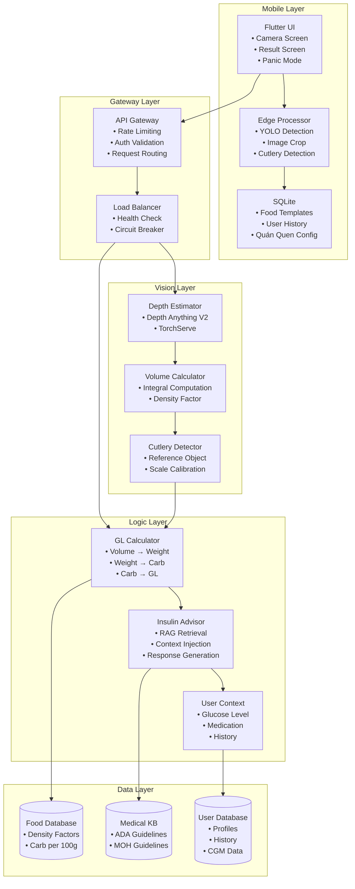
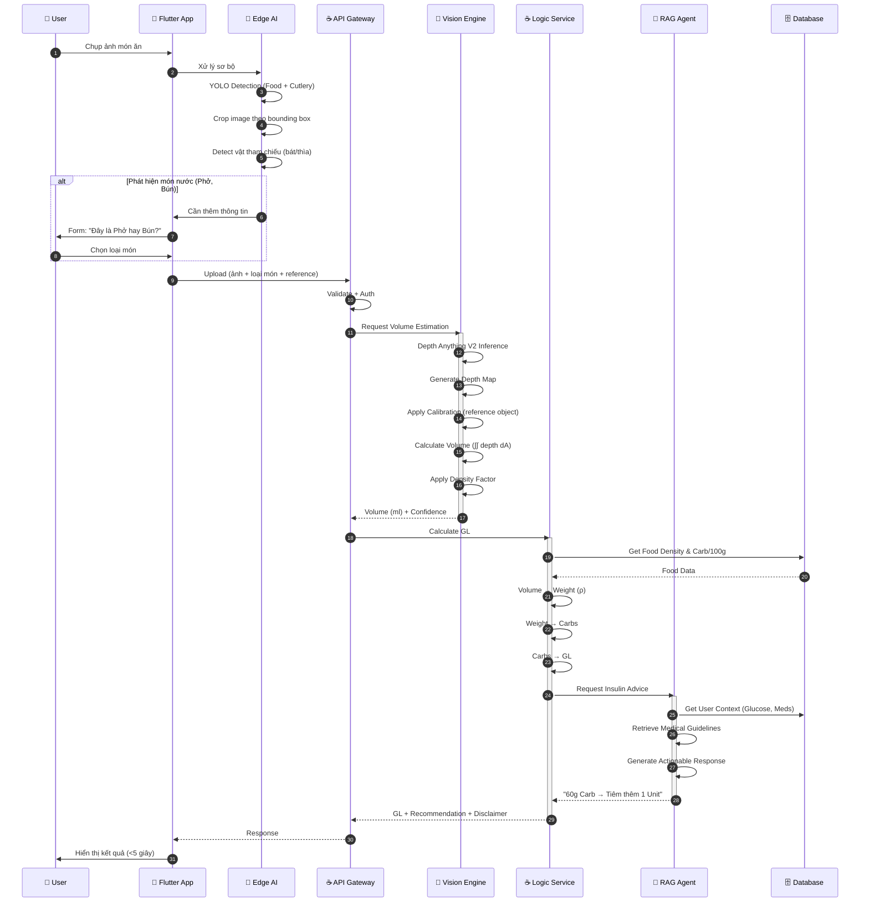
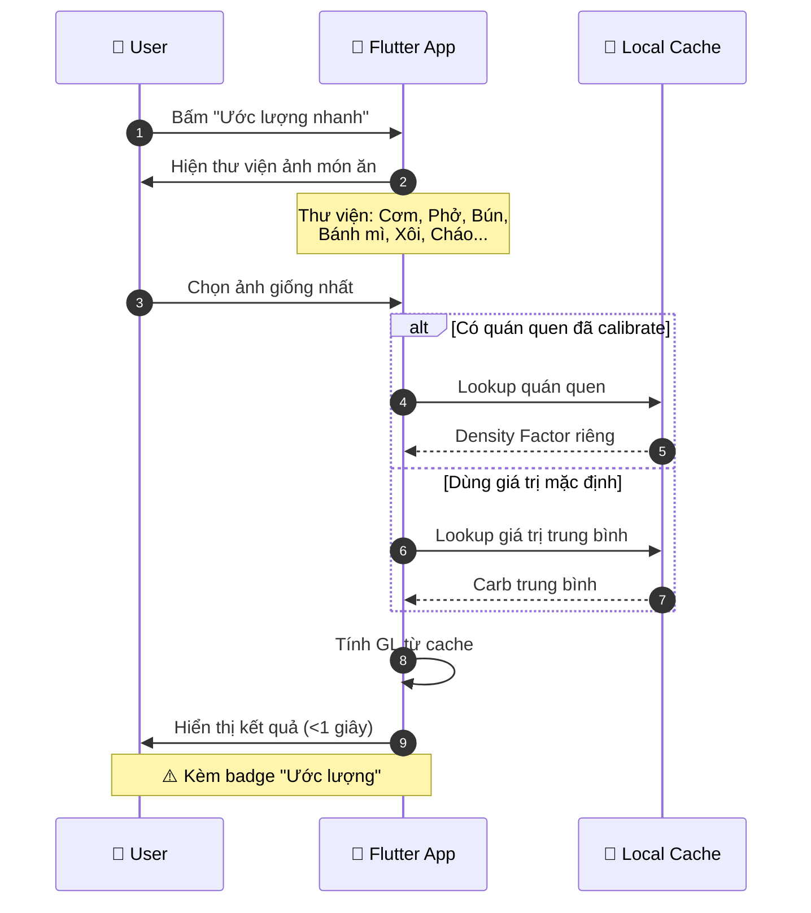
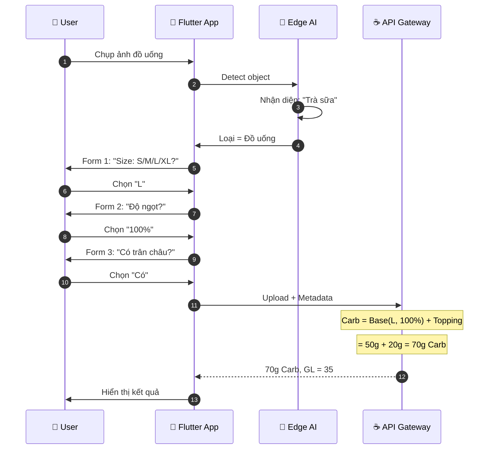
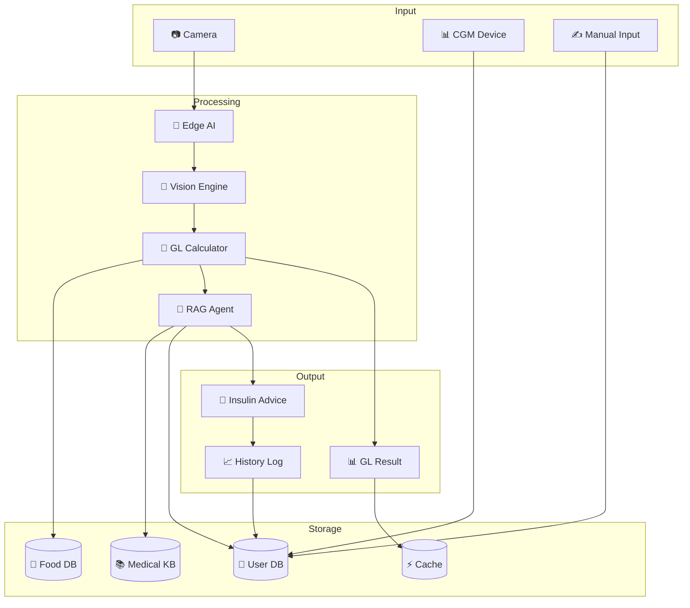
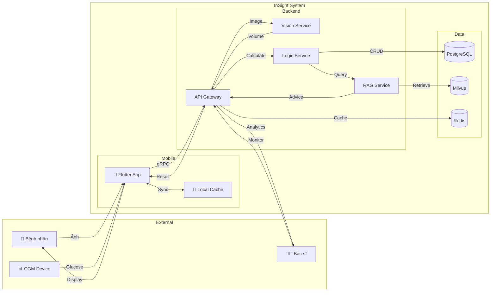
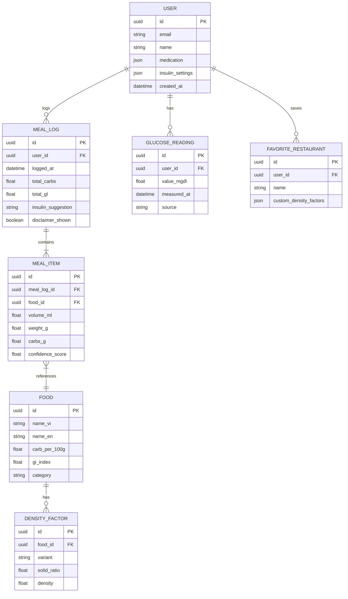

# Kiến trúc hệ thống InSight

> Tài liệu chi tiết về kiến trúc kỹ thuật của hệ thống ước lượng Glycemic Load

---

## Mục lục

1. [Tổng quan kiến trúc](#1-tổng-quan-kiến-trúc)
2. [Sơ đồ thành phần hệ thống](#2-sơ-đồ-thành-phần-hệ-thống)
3. [Luồng xử lý](#3-luồng-xử-lý)
4. [Luồng dữ liệu](#4-luồng-dữ-liệu)
5. [Kiến trúc từng layer](#5-kiến-trúc-từng-layer)
6. [Công nghệ và lý do lựa chọn](#6-công-nghệ-và-lý-do-lựa-chọn)

---

## 1. Tổng quan kiến trúc

### 1.1 Phong cách kiến trúc

Hệ thống InSight được xây dựng theo kiến trúc **Hybrid Edge-Cloud Event-Driven** kết hợp **Clean Architecture**:

- **Edge Computing:** Xử lý sơ bộ trên thiết bị mobile (YOLO detection, image preprocessing)
- **Cloud Processing:** Xử lý nặng trên server (Depth estimation, RAG Agent)
- **Event-Driven:** Giao tiếp giữa services qua Kafka events
- **Clean Architecture:** Tách biệt rõ ràng giữa các layer (Presentation, Domain, Data)

### 1.2 Nguyên tắc thiết kế

- **Separation of Concerns:** Mỗi service làm một việc
- **Loose Coupling:** Services giao tiếp qua message queue
- **Fail-Safe:** Có fallback cho mọi tình huống (Panic Mode)
- **User-Centric:** Ưu tiên tốc độ và UX hơn độ chính xác tuyệt đối

---

## 2. Sơ đồ thành phần hệ thống

### 2.1 High-Level Architecture (Tổng quan dễ hiểu)

Mô hình hoạt động như một **Bệnh viện thu nhỏ**:

- **Mobile (Y tá):** Xử lý sơ cứu, lọc nhiễu, phản ứng nhanh.
- **Cloud (Bác sĩ):** Xử lý chuyên sâu, chẩn đoán hình ảnh 3D và kê đơn thuốc.

```mermaid
graph LR
    subgraph "TIỀN TUYẾN (Mobile App)"
        User((Người dùng)) -->|Chụp ảnh| Mobile[App InSight]
        Mobile -->|1. Sàng lọc & Cắt vật thể| EdgeAI[AI Sơ bộ (YOLO Int8)]
        Mobile -.->|⚠️ Mất mạng/Khẩn cấp| Panic[Panic Mode (Offline)]
    end

    EdgeAI ==>|2. Vận chuyển tốc độ cao (gRPC)| Gateway[API Gateway]

    subgraph "HẬU PHƯƠNG (Cloud Server)"
        Gateway -->|3. Hàng đợi xử lý| Queue[Kafka Queue]
        Queue --> Vision[AI Thị giác 3D<br/>(Depth Anything)]
        Vision -->|Thể tích| Logic[Tính toán Dinh dưỡng]
        Logic <-->|4. Hội chẩn| RAG[Bác sĩ AI (RAG Agent)]
    end

    Panic -.->|Ước lượng nhanh| User
    Logic ==>|Chính xác cá nhân hóa| User
```

### 2.2 Component Diagram (Chi tiết)



---

## 3. Luồng xử lý

### 3.1 Luồng chuẩn (Standard Mode)



### 3.2 Luồng nhanh (Panic Mode)



### 3.3 Luồng đồ uống (có Carb ẩn)



---

## 4. Luồng dữ liệu

### 4.1 Data Flow Overview



### 4.2 Data Flow Chi tiết (C4 Level 2)



---

## 5. Kiến trúc từng layer

### 5.1 Mobile Layer (Flutter)

```
lib/
├── core/
│   ├── constants/
│   ├── utils/
│   └── di/                 # Dependency Injection
├── data/
│   ├── models/             # Data models
│   ├── repositories/       # Repository implementations
│   └── datasources/
│       ├── local/          # SQLite, SharedPrefs
│       └── remote/         # gRPC client
├── domain/
│   ├── entities/           # Business entities
│   ├── repositories/       # Repository interfaces
│   └── usecases/           # Business logic
├── presentation/
│   ├── screens/
│   │   ├── camera/         # Chụp ảnh
│   │   ├── result/         # Hiển thị kết quả
│   │   ├── panic/          # Panic Mode
│   │   └── settings/       # Cài đặt, quán quen
│   ├── widgets/
│   └── bloc/               # State management
└── edge/
    ├── yolo/               # YOLO detection
    ├── onnx/               # ONNX runtime
    └── preprocessing/      # Image preprocessing
```

### 5.2 Backend Layer (Java + Python)

```
backend/
├── api-gateway/                    # Spring Boot Gateway
│   ├── src/main/java/
│   │   ├── config/
│   │   ├── controller/
│   │   ├── filter/                 # Auth, Rate limiting
│   │   └── grpc/                   # gRPC endpoints
│   └── src/main/proto/             # Protobuf definitions
│
├── vision-service/                 # Python Vision Engine
│   ├── models/
│   │   ├── depth_anything/         # Depth estimation
│   │   └── cutlery_detector/       # Reference detection
│   ├── services/
│   │   ├── depth_service.py
│   │   ├── volume_service.py
│   │   └── calibration_service.py
│   └── api/
│       └── grpc_server.py
│
├── logic-service/                  # Java Logic Service
│   ├── src/main/java/
│   │   ├── domain/
│   │   │   ├── entity/
│   │   │   ├── repository/
│   │   │   └── service/
│   │   ├── application/
│   │   │   ├── usecase/
│   │   │   └── dto/
│   │   └── infrastructure/
│   │       ├── persistence/
│   │       ├── messaging/          # Kafka
│   │       └── external/           # CGM API
│   └── src/main/resources/
│
└── rag-service/                    # RAG Agent
    ├── src/main/java/
    │   ├── langchain/              # LangChain4j integration
    │   ├── retrieval/              # Vector search
    │   ├── generation/             # Response generation
    │   └── prompts/                # Prompt templates
    └── knowledge/
        └── medical/                # ADA/MOH guidelines
```

### 5.3 Data Layer



---

## 6. Công nghệ và lý do lựa chọn

### 6.1 Mobile

| Công nghệ    | Phiên bản | Lý do lựa chọn                               |
| ------------ | --------- | -------------------------------------------- |
| Flutter      | 3.x       | Cross-platform, 60fps, hot reload            |
| ONNX Runtime | 1.17      | Chạy model AI trên mobile, Int8 quantization |
| gRPC         | -         | Nhanh hơn REST 7-10x, strongly typed         |
| SQLite       | -         | Offline storage, Panic Mode cache            |

### 6.2 Backend

| Công nghệ         | Phiên bản | Lý do lựa chọn                          |
| ----------------- | --------- | --------------------------------------- |
| Java 21           | LTS       | Virtual Threads, GraalVM ready          |
| Spring Boot       | 3.3       | Production-ready, ecosystem phong phú   |
| Python            | 3.11+     | AI/ML ecosystem, PyTorch support        |
| Depth Anything V2 | Latest    | SOTA monocular depth estimation         |
| LangChain4j       | 0.28+     | Native Java AI, không cần Python bridge |

### 6.3 Data & Infrastructure

| Công nghệ      | Phiên bản | Lý do lựa chọn                |
| -------------- | --------- | ----------------------------- |
| PostgreSQL     | 16        | ACID, JSON support, mature    |
| Milvus         | 2.3       | Vector search, HNSW index     |
| Redis          | 7         | In-memory cache, pub/sub      |
| Apache Kafka   | -         | Event-driven, high throughput |
| Docker Compose | -         | Dev environment consistency   |

### 6.4 Observability

| Công nghệ              | Mục đích            |
| ---------------------- | ------------------- |
| Prometheus + Grafana   | Metrics, dashboard  |
| Loki + Promtail        | Centralized logging |
| OpenTelemetry + Jaeger | Distributed tracing |

### 6.5 Security

| Công nghệ         | Mục đích                      |
| ----------------- | ----------------------------- |
| Keycloak          | OAuth2/OIDC, SSO              |
| Spring Security 6 | JWT validation, rate limiting |
| TLS 1.3           | Transport encryption          |
| AES-256           | Data at rest encryption       |

---

## Tài liệu tham khảo

- [Depth Anything V2](https://github.com/DepthAnything/Depth-Anything-V2)
- [LangChain4j](https://github.com/langchain4j/langchain4j)
- [Milvus Documentation](https://milvus.io/docs)
- [Spring Boot 3.3 Reference](https://docs.spring.io/spring-boot/docs/3.3.x/reference/html/)

---

_Cập nhật lần cuối: 28-01-2026_
