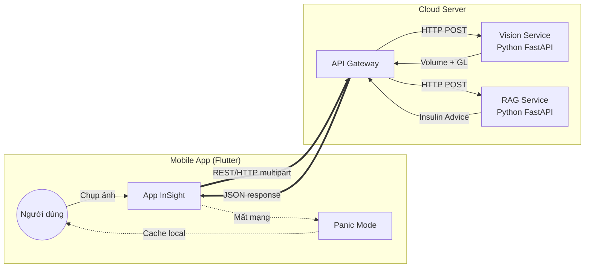
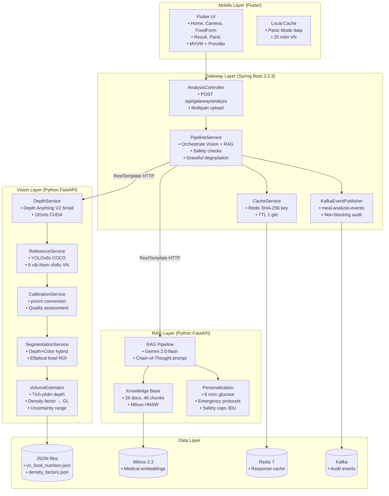
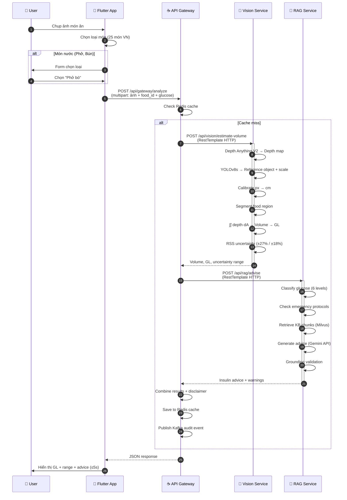
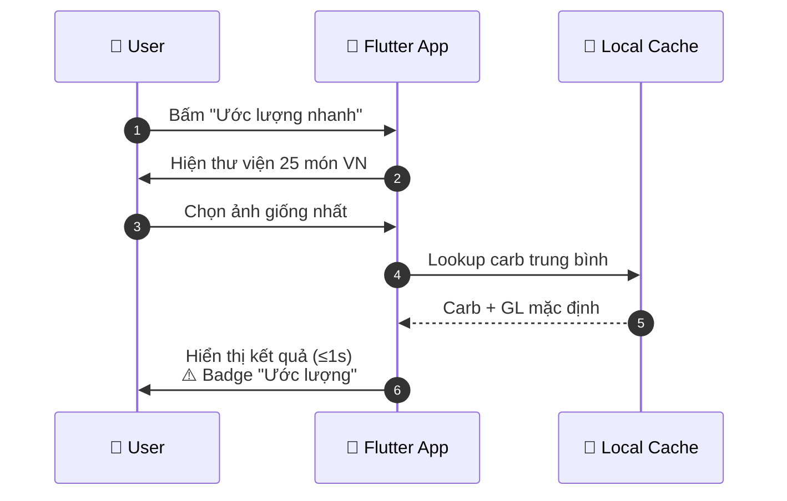
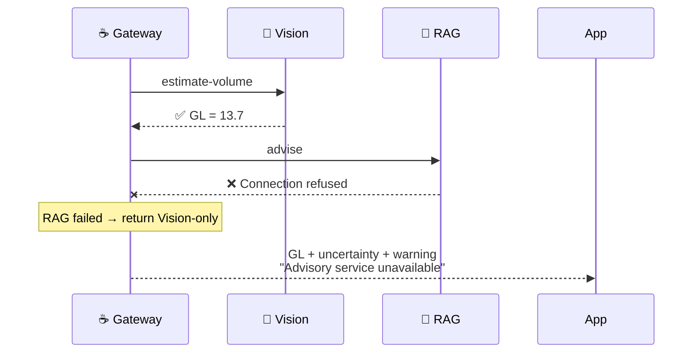
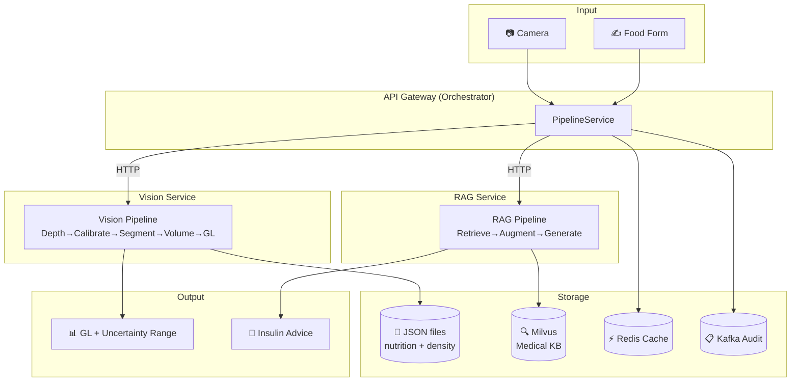

# Kiến trúc hệ thống InSight

> Tài liệu chi tiết về kiến trúc kỹ thuật **thực tế đã triển khai** của hệ thống ước lượng Glycemic Load

---

## Mục lục

1. [Tổng quan kiến trúc](#1-tổng-quan-kiến-trúc)
2. [Sơ đồ thành phần hệ thống](#2-sơ-đồ-thành-phần-hệ-thống)
3. [Luồng xử lý](#3-luồng-xử-lý)
4. [Luồng dữ liệu](#4-luồng-dữ-liệu)
5. [Kiến trúc từng layer](#5-kiến-trúc-từng-layer)
6. [Công nghệ và lý do lựa chọn](#6-công-nghệ-và-lý-do-lựa-chọn)

---

## 1. Tổng quan kiến trúc

### 1.1 Phong cách kiến trúc

Hệ thống InSight được xây dựng theo kiến trúc **Hybrid Edge-Cloud** gồm 3 backend microservices giao tiếp qua **REST/HTTP**:

- **API Gateway (Spring Boot):** Orchestration, cache, audit
- **Vision Service (Python FastAPI):** Depth estimation → Volume → GL
- **RAG Service (Python FastAPI):** Knowledge retrieval → Insulin advice
- **Mobile (Flutter):** Giao diện người dùng, chụp ảnh, hiển thị kết quả

### 1.2 Nguyên tắc thiết kế

- **Separation of Concerns:** Mỗi service đảm nhiệm một vai trò rõ ràng
- **REST-first:** Giao tiếp giữa services qua HTTP REST (RestTemplate)
- **Fail-Safe:** RAG fail → trả Vision-only + warning; Redis fail → bỏ cache
- **User-Centric:** Ưu tiên tốc độ (≤5s chuẩn, ≤1s Panic Mode)
- **Honest Reporting:** Báo cáo uncertainty range thay vì single point estimate

---

## 2. Sơ đồ thành phần hệ thống

### 2.1 High-Level Architecture


```mermaid
graph LR
    subgraph "Mobile App (Flutter)"
        User((Người dùng)) -->|Chụp ảnh| Mobile[App InSight]
        Mobile -.->|Mất mạng| Panic[Panic Mode]
    end

    Mobile ==>|REST/HTTP multipart| Gateway[API Gateway]

    subgraph "Cloud Server"
        Gateway -->|HTTP POST| Vision[Vision Service<br/>Python FastAPI]
        Gateway -->|HTTP POST| RAG[RAG Service<br/>Python FastAPI]
        Vision -->|Volume + GL| Gateway
        RAG -->|Insulin Advice| Gateway
    end

    Gateway ==>|JSON response| Mobile
    Panic -.->|Cache local| User
```

### 2.2 Component Diagram (Chi tiết thực tế)


```mermaid
graph TD
    subgraph "Mobile Layer (Flutter)"
        UI[Flutter UI<br/>• Home, Camera, FoodForm<br/>• Result, Panic<br/>• MVVM + Provider]
        LocalCache[Local Cache<br/>• Panic Mode data<br/>• 25 món VN]
    end

    subgraph "Gateway Layer (Spring Boot 3.2.3)"
        APIGateway[AnalysisController<br/>• POST /api/gateway/analyze<br/>• Multipart upload]
        Pipeline[PipelineService<br/>• Orchestrate Vision + RAG<br/>• Safety checks<br/>• Graceful degradation]
        Cache[CacheService<br/>• Redis SHA-256 key<br/>• TTL 1 giờ]
        Kafka[KafkaEventPublisher<br/>• meal-analysis-events<br/>• Non-blocking audit]
    end

    subgraph "Vision Layer (Python FastAPI)"
        Depth[DepthService<br/>• Depth Anything V2 Small<br/>• 181ms CUDA]
        Reference[ReferenceService<br/>• YOLOv8s COCO<br/>• 6 vật tham chiếu VN]
        Calibration[CalibrationService<br/>• px/cm conversion<br/>• Quality assessment]
        Segmentation[SegmentationService<br/>• Depth+Color hybrid<br/>• Elliptical bowl ROI]
        Volume[VolumeEstimator<br/>• Tích phân depth<br/>• Density factor → GL<br/>• Uncertainty range]
    end

    subgraph "RAG Layer (Python FastAPI)"
        KB[Knowledge Base<br/>• 26 docs, 46 chunks<br/>• Milvus HNSW]
        RAGPipe[RAG Pipeline<br/>• Gemini 2.0-flash<br/>• Chain-of-Thought prompt]
        Clinical[Personalization<br/>• 6 mức glucose<br/>• Emergency protocols<br/>• Safety caps 30U]
    end

    subgraph "Data Layer"
        FoodDB[(JSON files<br/>• vn_food_nutrition.json<br/>• density_factors.json)]
        Milvus[(Milvus 2.3<br/>• Medical embeddings)]
        Redis[(Redis 7<br/>• Response cache)]
        KafkaBroker[(Kafka<br/>• Audit events)]
    end

    UI --> APIGateway
    APIGateway --> Pipeline
    Pipeline --> Cache
    Pipeline --> Kafka
    Pipeline -->|RestTemplate HTTP| Depth
    Depth --> Reference
    Reference --> Calibration
    Calibration --> Segmentation
    Segmentation --> Volume
    Volume --> FoodDB
    Pipeline -->|RestTemplate HTTP| RAGPipe
    RAGPipe --> KB
    KB --> Milvus
    RAGPipe --> Clinical
    Cache --> Redis
    Kafka --> KafkaBroker
```

---

## 3. Luồng xử lý

### 3.1 Luồng chuẩn (Standard Mode — ≤ 5 giây)


```mermaid
sequenceDiagram
    autonumber
    participant User as 👤 User
    participant App as 📱 Flutter App
    participant Gateway as ☕ API Gateway
    participant Vision as 🐍 Vision Service
    participant RAG as 🤖 RAG Service

    User->>App: Chụp ảnh món ăn
    App->>App: Chọn loại món (25 món VN)

    alt Món nước (Phở, Bún)
        App->>User: Form chọn loại
        User->>App: Chọn "Phở bò"
    end

    App->>Gateway: POST /api/gateway/analyze<br/>(multipart: ảnh + food_id + glucose)
    Gateway->>Gateway: Check Redis cache

    alt Cache miss
        Gateway->>Vision: POST /api/vision/estimate-volume<br/>(RestTemplate HTTP)

        activate Vision
        Vision->>Vision: Depth Anything V2 → Depth map
        Vision->>Vision: YOLOv8s → Reference object + scale
        Vision->>Vision: Calibrate px → cm
        Vision->>Vision: Segment food region
        Vision->>Vision: ∫∫ depth·dA → Volume → GL
        Vision->>Vision: RSS uncertainty (±27% / ±18%)
        Vision-->>Gateway: Volume, GL, uncertainty range
        deactivate Vision

        Gateway->>RAG: POST /api/rag/advise<br/>(RestTemplate HTTP)

        activate RAG
        RAG->>RAG: Classify glucose (6 levels)
        RAG->>RAG: Check emergency protocols
        RAG->>RAG: Retrieve KB chunks (Milvus)
        RAG->>RAG: Generate advice (Gemini API)
        RAG->>RAG: Grounding validation
        RAG-->>Gateway: Insulin advice + warnings
        deactivate RAG

        Gateway->>Gateway: Combine results + disclaimer
        Gateway->>Gateway: Save to Redis cache
        Gateway->>Gateway: Publish Kafka audit event
    end

    Gateway-->>App: JSON response
    App->>User: Hiển thị GL + range + advice (≤5s)
```

### 3.2 Luồng nhanh (Panic Mode — ≤ 1 giây)


```mermaid
sequenceDiagram
    autonumber
    participant User as 👤 User
    participant App as 📱 Flutter App
    participant Cache as 💾 Local Cache

    User->>App: Bấm "Ước lượng nhanh"
    App->>User: Hiện thư viện 25 món VN
    User->>App: Chọn ảnh giống nhất
    App->>Cache: Lookup carb trung bình
    Cache-->>App: Carb + GL mặc định
    App->>User: Hiển thị kết quả (≤1s)<br/>⚠️ Badge "Ước lượng"
```

### 3.3 Luồng xử lý lỗi (Graceful Degradation)


```mermaid
sequenceDiagram
    participant Gateway as ☕ Gateway
    participant Vision as 🐍 Vision
    participant RAG as 🤖 RAG

    Gateway->>Vision: estimate-volume
    Vision-->>Gateway: ✅ GL = 13.7

    Gateway->>RAG: advise
    RAG--xGateway: ❌ Connection refused

    Note over Gateway: RAG failed → return Vision-only
    Gateway-->>App: GL + uncertainty + warning<br/>"Advisory service unavailable"
```

---

## 4. Luồng dữ liệu

### 4.1 Data Flow Overview


```mermaid
flowchart TB
    subgraph Input
        Camera[📷 Camera]
        Manual[✍️ Food Form]
    end

    subgraph "API Gateway (Orchestrator)"
        Pipeline[PipelineService]
    end

    subgraph "Vision Service"
        VisionEngine[Vision Pipeline<br/>Depth→Calibrate→Segment→Volume→GL]
    end

    subgraph "RAG Service"
        RAGAgent[RAG Pipeline<br/>Retrieve→Augment→Generate]
    end

    subgraph Storage
        FoodJSON[(📁 JSON files<br/>nutrition + density)]
        MilvusDB[(🔍 Milvus<br/>Medical KB)]
        RedisCache[(⚡ Redis Cache)]
        KafkaAudit[(📋 Kafka Audit)]
    end

    subgraph Output
        Result[📊 GL + Uncertainty Range]
        Advice[💊 Insulin Advice]
    end

    Camera --> Pipeline
    Manual --> Pipeline

    Pipeline -->|HTTP| VisionEngine
    Pipeline -->|HTTP| RAGAgent
    Pipeline --> RedisCache
    Pipeline --> KafkaAudit

    VisionEngine --> FoodJSON
    RAGAgent --> MilvusDB

    VisionEngine --> Result
    RAGAgent --> Advice
```

---

## 5. Kiến trúc từng layer

### 5.1 Mobile Layer (Flutter — MVVM + Provider)

```
src/mobile/insight_app/
├── lib/
│   ├── main.dart
│   ├── app.dart
│   ├── config/
│   │   └── routes.dart           # go_router
│   ├── models/
│   │   ├── food_item.dart
│   │   ├── meal_analysis.dart    # + DebugData
│   │   └── patient_context.dart
│   ├── viewmodels/
│   │   ├── meal_viewmodel.dart   # MVVM + Provider
│   │   └── panic_viewmodel.dart
│   ├── screens/
│   │   ├── home_screen.dart
│   │   ├── camera_screen.dart
│   │   ├── food_form_screen.dart  # 25 món VN + debug toggle
│   │   ├── result_screen.dart     # GL + uncertainty + developer panel
│   │   └── panic_screen.dart
│   └── widgets/
│       ├── gl_indicator.dart
│       └── disclaimer_banner.dart
└── test/                          # 40 tests
```

### 5.2 API Gateway (Spring Boot 3.2.3, Java 17)

```
src/api-gateway/
└── src/main/java/com/insight/
    ├── ApiGatewayApplication.java
    ├── controller/
    │   └── AnalysisController.java    # POST /api/gateway/analyze (multipart)
    ├── service/
    │   ├── PipelineService.java       # Orchestrate Vision + RAG
    │   ├── CacheService.java          # Redis SHA-256, TTL 1h
    │   └── KafkaEventPublisher.java   # meal-analysis-events
    ├── client/
    │   ├── VisionServiceClient.java   # RestTemplate → Vision
    │   └── RagServiceClient.java      # RestTemplate → RAG
    └── config/
        ├── RestTemplateConfig.java
        └── RedisConfig.java
```

### 5.3 Vision Service (Python FastAPI)

```
src/vision-service/
├── main.py                        # FastAPI app, 7 endpoints
├── models/
│   └── depth_model.py             # DAv2 Small wrapper (singleton)
├── services/
│   ├── depth_service.py           # Depth map generation
│   ├── reference_service.py       # YOLOv8s COCO + VN tableware
│   ├── calibration_service.py     # px/cm + quality assessment
│   ├── segmentation_service.py    # Depth+Color hybrid
│   ├── volume_service.py          # Volume → Weight → Carb → GL + uncertainty
│   └── validation_service.py      # APE/MAPE benchmark
├── schemas/
│   └── volume_schemas.py          # Pydantic response + uncertainty fields
└── tests/                         # 171 tests
```

### 5.4 RAG Service (Python FastAPI)

```
src/rag-service/
├── main.py                        # FastAPI: /api/rag/advise + /health
├── knowledge_base/
│   ├── schemas.py                 # Document, Chunk models
│   ├── chunking.py                # Semantic chunking
│   ├── embedding.py               # sentence-transformers 384D
│   └── search.py                  # Hybrid: BM25 + vector + re-ranking
├── rag_pipeline/
│   ├── schemas.py                 # RAG request/response
│   ├── llm_client.py             # OpenAI-compatible (Gemini default)
│   ├── prompt_builder.py          # Vietnamese SYSTEM_PROMPT
│   └── rag_service.py            # Orchestrator
├── personalization/
│   ├── emergency.py               # 6 glucose levels
│   ├── clinical_rules.py          # Rule-based insulin (NOT LLM)
│   └── grounding.py               # Validate LLM output
├── knowledge/medical/
│   └── guidelines.json            # 26 docs, 7 categories, 5 sources
└── tests/                         # 164 tests
```

### 5.5 Data Layer

Hệ thống sử dụng file JSON tĩnh cho nutrition data (không dùng PostgreSQL cho food data):

| Nguồn | File/Service | Nội dung |
|-------|-------------|----------|
| Food DB | `data/nutrition_db/vn_food_nutrition.json` | 25 món VN: GI, carb/100g |
| Density | `data/nutrition_db/density_factors.json` | 27 mục: solid_ratio, density |
| Medical KB | Milvus 2.3 | 46 chunks, HNSW index |
| Cache | Redis 7 | SHA-256 key, TTL 1h |
| Audit | Kafka | `meal-analysis-events` topic |

---

## 6. Công nghệ và lý do lựa chọn

### 6.1 Mobile

| Công nghệ    | Phiên bản | Lý do lựa chọn                               |
| ------------ | --------- | -------------------------------------------- |
| Flutter      | 3.x       | Cross-platform, 60fps, hot reload            |
| Provider     | -         | State management đơn giản cho MVVM           |
| go_router    | -         | Declarative routing                          |

### 6.2 Backend

| Công nghệ         | Phiên bản | Lý do lựa chọn                               |
| ----------------- | --------- | -------------------------------------------- |
| Java 17           | LTS       | Spring Boot 3.2.3 compatibility              |
| Spring Boot       | 3.2.3     | REST API Gateway, RestTemplate               |
| Python            | 3.11+     | AI/ML ecosystem, PyTorch, FastAPI            |
| Depth Anything V2 | Small     | SOTA monocular depth, 24.8M params           |
| YOLOv8s           | COCO      | Reference object detection, fallback mode    |
| Gemini API        | 2.0-flash | Free-tier LLM, OpenAI-compatible             |

### 6.3 Data & Infrastructure

| Công nghệ      | Phiên bản | Lý do lựa chọn                |
| -------------- | --------- | ----------------------------- |
| Milvus         | 2.3       | Vector search, HNSW index     |
| Redis          | 7         | Response cache, SHA-256 key   |
| Apache Kafka   | -         | Audit trail, non-blocking     |
| Docker Compose | -         | Dev environment consistency   |
| GitHub Actions | -         | CI/CD pipeline                |

### 6.4 Giao tiếp giữa services

| Từ | Đến | Protocol | Chi tiết |
|----|-----|----------|----------|
| Flutter | Gateway | REST/HTTP | `POST /api/gateway/analyze` (multipart) |
| Gateway | Vision | REST/HTTP | `RestTemplate` → `POST /api/vision/estimate-volume` |
| Gateway | RAG | REST/HTTP | `RestTemplate` → `POST /api/rag/advise` |
| Gateway | Redis | Redis protocol | `CacheService` — SHA-256 key lookup |
| Gateway | Kafka | Kafka protocol | `KafkaEventPublisher` — fire-and-forget |

> **Lưu ý:** Hệ thống sử dụng REST/HTTP cho tất cả giao tiếp giữa services. Không sử dụng gRPC hay Protobuf.

---

## Tài liệu tham khảo

- [Depth Anything V2](https://github.com/DepthAnything/Depth-Anything-V2)
- [Google Gemini API](https://ai.google.dev/gemini-api/docs)
- [Milvus Documentation](https://milvus.io/docs)
- [Spring Boot 3.2 Reference](https://docs.spring.io/spring-boot/docs/3.2.x/reference/html/)

---

_Cập nhật lần cuối: 13/05/2026 — Đồng bộ với kiến trúc thực tế đã triển khai_
