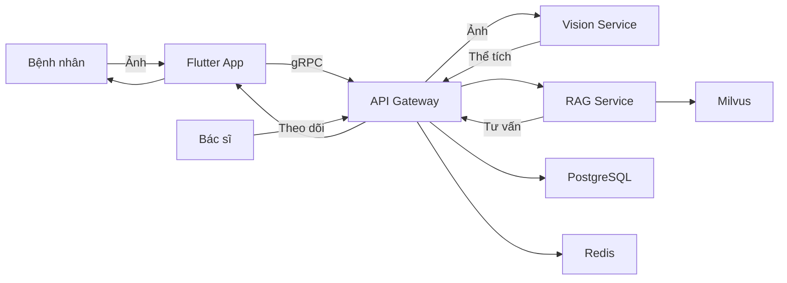
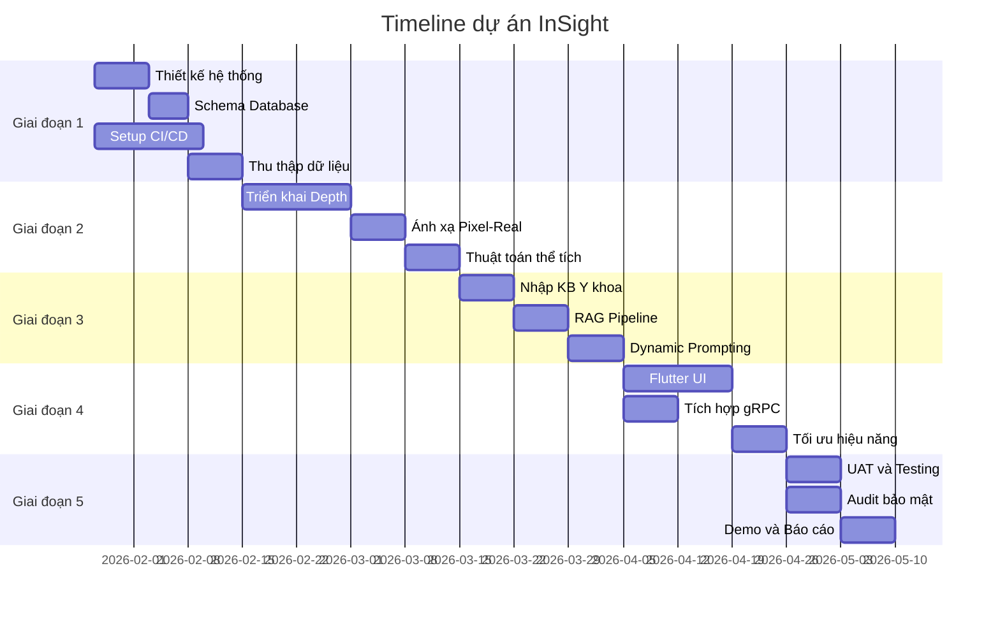
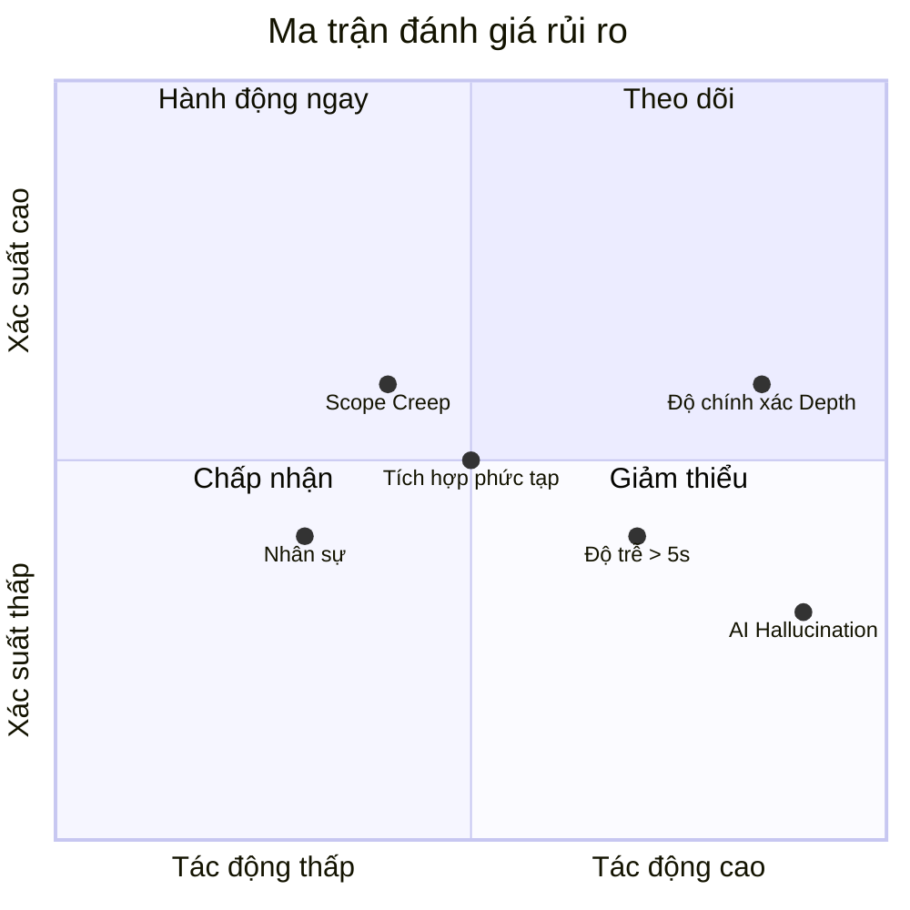
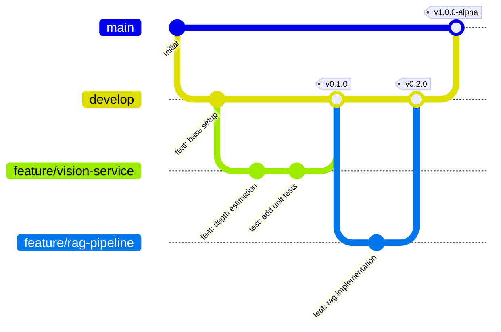

# KẾ HOẠCH DỰ ÁN: InSight (Insulin - Insight)

**Hệ thống ước lượng Glycemic Load thời gian thực cho bệnh nhân tiểu đường**  
_Sử dụng Computer Vision 3D và RAG Agent cá nhân hóa_

---

## Mục lục

1. [Thông tin dự án](#1-thông-tin-dự-án)
2. [Vấn đề và giải pháp](#2-vấn-đề-và-giải-pháp)
3. [Kiến trúc hệ thống](#3-kiến-trúc-hệ-thống)
4. [Công nghệ sử dụng](#4-công-nghệ-sử-dụng)
5. [Lộ trình thực hiện](#5-lộ-trình-thực-hiện)
6. [Phạm vi công việc](#6-phạm-vi-công-việc)
7. [Quản lý rủi ro](#7-quản-lý-rủi-ro)
8. [Đảm bảo chất lượng](#8-đảm-bảo-chất-lượng)
9. [Quy trình làm việc](#9-quy-trình-làm-việc)
10. [Chỉ số thành công](#10-chỉ-số-thành-công)
11. [Tầm nhìn](#11-tầm-nhìn)

---

## 1. Thông tin dự án

**Tên đề tài:** "Phát triển hệ thống ước lượng Glycemic Load thời gian thực cho bệnh nhân tiểu đường sử dụng Computer Vision 3D và RAG Agent cá nhân hóa"

- **Mã dự án:** INSIGHT-2026
- **Thời gian:** 16 tuần (4 tháng)
- **Số thành viên:** 3 người
- **Phương pháp:** Agile / Scrum

### Phân công nhóm

**Tôi (Leader/Architect):**

- Vai trò: Tech Lead + Product Owner + AI Lead
- Trách nhiệm: Thiết kế kiến trúc tổng thể, ra quyết định kỹ thuật, quản lý tiến độ, phát triển RAG Agent
- Phụ trách: Vision tổng thể, tích hợp hệ thống, đảm bảo chất lượng

**V (Core Developer):**

- Vai trò: Backend Lead + Vision Engineer
- Trách nhiệm: Triển khai Vision Engine (Depth Anything V2), Backend Java/Spring Boot, gRPC
- Điểm mạnh: Kỹ thuật tốt, implementation nhanh
- Lưu ý: Cần được giao task cụ thể, rõ ràng

**HI (Support Developer):**

- Vai trò: Frontend + Testing + Documentation
- Trách nhiệm: Flutter UI, thu thập dữ liệu, viết tài liệu, hỗ trợ testing
- Điểm mạnh: Làm việc đều đặn, hỗ trợ tốt các task được giao
- Phụ trách: Mobile UI, dataset, báo cáo

---

## 2. Vấn đề và giải pháp

### 2.1 Vấn đề cần giải quyết

**Ước lượng Carb không chính xác:**

- Bệnh nhân tiểu đường (Type 1, Type 2 nặng) cần kiểm soát chính xác lượng Carbohydrate để tính liều Insulin
- Sai lệch 50g Carb có thể gây biến chứng cấp tính (hạ đường huyết / nhiễm toan ceton)

**Hạn chế của cơ sở dữ liệu tĩnh:**

- Các app như MyFitnessPal chỉ có dữ liệu tĩnh ("1 bát cơm" mà không tính đến kích thước thật)
- Dẫn đến sai số về thể tích, tính sai liều thuốc

**Phân loại vs Định lượng:**

- AI tiêu chuẩn (Google Lens) chỉ phân loại được ("Đây là bánh") chứ không định lượng được ("Bánh này bao nhiêu gram?")
- Không có chỉ số hành động được cho việc quản lý tiểu đường

### 2.2 Khoảng trống nghiên cứu

- Chưa có app nào tại Việt Nam tích hợp ước lượng thể tích từ ảnh 2D
- GL quan trọng hơn Calories đối với bệnh nhân tiểu đường
- Thiếu tư vấn có ngữ cảnh (đường huyết hiện tại, thuốc đang dùng)

### 2.3 Thách thức thực tiễn và giải pháp

> _"Người dùng tiểu đường không cần phòng thí nghiệm trong túi quần. Họ cần trợ lý nhanh nhạy và hiểu chuyện."_

**Vấn đề vật tham chiếu:**

- Vấn đề: Yêu cầu đặt thẻ ATM/đồng xu cạnh món ăn → Mất vệ sinh, kỳ quặc
- Giải pháp: AI tự nhận diện bát/thìa/đũa tiêu chuẩn Việt Nam làm vật tham chiếu

**Vấn đề món ẩn:**

- Vấn đề: Món nước (Phở, Bún) che khuất thực phẩm bên dưới
- Giải pháp: Kết hợp CV + Form hỏi nhanh + Hệ số mật độ thống kê
- Cải tiến: Cho phép người dùng **calibrate theo quán quen** (VD: "Phở Thìn = 45% đặc") và lưu lại

**Vấn đề độ trễ:**

- Vấn đề: 12 giây quá lâu khi đang đói/hạ đường huyết
- Giải pháp: Chế độ "Ước lượng nhanh" dưới 1 giây từ thư viện ảnh

**AI quá dài dòng:**

- Vấn đề: Lời khuyên dài, không thực tế
- Giải pháp: Trả lời ngắn gọn, đi thẳng vào liều insulin cần tiêm

**Mục đích RAG chưa rõ:**

- Vấn đề: Chưa rõ RAG hỗ trợ gì cho bệnh nhân
- Giải pháp: Thu thập thông tin bổ sung qua form để tính GL chính xác hơn

---

## 3. Kiến trúc hệ thống

Hệ thống theo kiến trúc **Hybrid Edge-Cloud Event-Driven** kết hợp **Clean Architecture**.

### 3.1 Sơ đồ thành phần

```mermaid
graph TD
    subgraph "Mobile"
        Mobile[Flutter App] -->|Chụp ảnh| EdgeAI[Xử lý trên thiết bị - YOLO + ONNX]
    end

    subgraph "Gateway"
        EdgeAI -->|gRPC| Gateway[API Gateway - Spring Boot]
    end

    subgraph "Xử lý chính"
        Gateway -->|Kafka| VisionService[Python Vision Engine]
        VisionService --> DepthMap[Tạo Depth Map]
        DepthMap --> Volume[Tính thể tích]
    end

    subgraph "RAG"
        Volume -->|Kafka| JavaCore[Java Logic Service]
        JavaCore --> VectorDB[Milvus Vector DB]
        JavaCore --> LLM[LLM Agent - LangChain4j]
        LLM --> JavaCore
    end

    subgraph "Dữ liệu"
        JavaCore --> PostgreSQL[PostgreSQL]
        JavaCore --> Redis[Redis Cache]
    end

    JavaCore --> Mobile
```

### 3.2 Luồng xử lý

#### Chế độ chuẩn (ước lượng chính xác)

1. Người dùng chụp ảnh món ăn
2. App nhận diện bát/thìa/đũa làm vật tham chiếu
3. Nếu phát hiện món nước (Phở, Bún): Hiện form hỏi "Đây là Phở hay Bún?"
4. Upload ảnh + loại món + vật tham chiếu lên server
5. Vision Engine chạy Depth Anything V2, áp dụng Density Factor
6. Tính thể tích thực → Khối lượng → Carb → GL
7. RAG Agent tra cứu hướng dẫn insulin, trả về: "60g Carb → Tiêm thêm 1 Unit"
8. Hiển thị kết quả (dưới 5 giây)

#### Chế độ nhanh (khẩn cấp)

1. Người dùng bấm nút "Ước lượng nhanh"
2. Hiện thư viện ảnh món ăn (Cơm, Phở, Bánh mì...)
3. Chọn ảnh giống nhất
4. Tra cứu Carb trung bình từ cache local
5. Hiển thị kết quả (dưới 1 giây)

### 3.3 Sơ đồ luồng dữ liệu



---

## 4. Công nghệ sử dụng

### 4.1 Công nghệ lõi

**Mobile:**

- Flutter + ONNX Runtime (v3.x / 1.17)
- Cross-platform 60fps, chạy model đã lượng tử hóa

**Backend:**

- Java 21 + Spring Boot 3.3
- Virtual Threads cho concurrency cao, sẵn sàng GraalVM

**Giao tiếp:**

- gRPC + Protobuf (v1.60+)
- Nhanh hơn REST 7-10 lần

**Vision Engine:**

- Python 3.11+ với Depth Anything V2
- Deploy qua TorchServe

**GenAI / RAG:**

- LangChain4j + Milvus (v0.28+ / 2.3+)
- Tích hợp AI native Java, HNSW index cho vector search nhanh

### 4.2 Hạ tầng dữ liệu

- **Database chính:** PostgreSQL 16 - Dữ liệu giao dịch, hồ sơ người dùng, database món ăn
- **Vector DB:** Milvus 2.3 - Embedding kiến thức y khoa, tìm kiếm ngữ nghĩa
- **Cache:** Redis 7 - Session, rate limiting, cache dữ liệu hot
- **Message Queue:** Apache Kafka - Giao tiếp event-driven giữa services
- **Container:** Docker + Compose - Môi trường dev và staging
- **CI/CD:** GitHub Actions - Pipeline test, build, deploy tự động

### 4.3 Giám sát hệ thống

- **Metrics:** Prometheus + Grafana - Đo lường hệ thống, dashboard SLA
- **Logging:** Loki + Promtail - Gom log tập trung
- **Tracing:** OpenTelemetry + Jaeger - Tracing phân tán

### 4.4 Bảo mật

- **Xác thực:** Keycloak (OAuth2/OIDC) - IAM, RBAC, SSO
- **API Security:** Spring Security 6 - JWT, rate limiting
- **Mã hóa:** AES-256 / TLS 1.3
- **Tuân thủ:** Thiết kế theo chuẩn HIPAA

---

## 5. Lộ trình thực hiện

Dự án theo Agile/Scrum với Sprint 2 tuần.

### 5.1 Tổng quan timeline



### 5.2 Chi tiết từng giai đoạn

#### Giai đoạn 1: Nền tảng và Dữ liệu (Tuần 1-3)

**Sprint 0 - Khởi động:**

- Tài liệu kiến trúc, setup Git repo
- Tiêu chí: Team đồng bộ
- **Phân công:** Tôi (kiến trúc) + HI (setup repo, README)

**Sprint 1 - Hạ tầng:**

- PostgreSQL + Milvus chạy được, CI/CD xanh
- Tiêu chí: `docker compose up` thành công
- **Phân công:** V (Docker, database) + Tôi (review)

**Sprint 2 - Thu thập dữ liệu:**

- Dataset 10 món Việt Nam
- Tiêu chí: Có dữ liệu ground-truth thể tích
- **Phân công:** HI (chụp ảnh, đo thể tích) + Tôi (định nghĩa format)

#### Giai đoạn 2: Vision Engine (Tuần 4-7)

**Sprint 3 - Model Depth:**

- Service inference Depth Anything V2
- Tiêu chí: Tạo được depth map
- **Phân công:** V (triển khai model) + Tôi (hướng dẫn, review)

**Sprint 4 - Hiệu chuẩn:**

- Thuật toán ánh xạ Pixel sang thực
- Tiêu chí: Sai số dưới 10% với vật tham chiếu
- **Phân công:** V (thuật toán) + HI (test với dữ liệu thực)

**Sprint 5 - Tính thể tích:**

- Ước lượng thể tích end-to-end
- Tiêu chí: Sai số dưới 15%
- **Phân công:** V (tích hợp) + HI (validation) + Tôi (review)

#### Giai đoạn 3: RAG và Logic (Tuần 8-10)

**Sprint 6 - Kiến thức Y khoa:**

- Nhập hướng dẫn ADA/MOH vào Milvus
- Tiêu chí: Hybrid search hoạt động
- **Phân công:** Tôi (RAG setup) + HI (thu thập tài liệu y khoa)

**Sprint 7 - RAG Pipeline:**

- Tích hợp LangChain4j
- Tiêu chí: Response có ngữ cảnh
- **Phân công:** Tôi (LangChain4j) + V (API endpoints)

**Sprint 8 - Cá nhân hóa:**

- Dynamic prompting dựa trên glucose
- Tiêu chí: Tư vấn chính xác lâm sàng
- **Phân công:** Tôi (prompting) + HI (test scenarios)

#### Giai đoạn 4: Tích hợp và Mobile (Tuần 11-13)

**Sprint 9 - Mobile UI:**

- Flutter app với các màn hình chính
- Tiêu chí: Prototype dùng được
- **Phân công:** HI (Flutter UI) + Tôi (UX design, review)

**Sprint 10 - Tích hợp E2E:**

- Full pipeline hoạt động
- Tiêu chí: Ảnh → Tư vấn dưới 5 giây
- **Phân công:** V (gRPC integration) + Tôi (orchestration) + HI (testing)

**Sprint 11 - Hiệu năng:**

- Tối ưu cold-start, caching
- Tiêu chí: API latency dưới 2 giây (p95)
- **Phân công:** V (optimization) + Tôi (review)

#### Giai đoạn 5: Kiểm thử và Hoàn thiện (Tuần 14-16)

**Sprint 12 - UAT:**

- Test với người dùng, so sánh với cân điện tử
- Tiêu chí: Trên 85% hài lòng
- **Phân công:** HI (tổ chức UAT) + Tôi (phân tích kết quả)

**Sprint 13 - Hoàn thiện:**

- Fix bugs, polish UI
- Tiêu chí: Sản phẩm ổn định
- **Phân công:** V (bug fixes) + HI (UI polish) + Tôi (prioritize)

**Sprint 14 - Chuẩn bị bảo vệ:**

- Video demo, báo cáo cuối
- Tiêu chí: Sẵn sàng bảo vệ luận văn
- **Phân công:** HI (báo cáo, slides) + Tôi (demo, review) + V (hỗ trợ kỹ thuật)

---

## 6. Phạm vi công việc

### 6.1 Nghiên cứu và AI

**Phân đoạn món ăn:**

- Fine-tune SAM (Segment Anything Model)
- Tham khảo: Meta AI SAM 2024

**Ước lượng độ sâu:**

- Triển khai Depth Anything V2
- Tham khảo: TikTok/DepthAnything 2024

**Nhận diện dụng cụ ăn:**

- Train model nhận diện bát/thìa/đũa tiêu chuẩn VN làm vật tham chiếu
- Custom Dataset

**Tính thể tích:**

- Công thức tích phân: V = ∫∫ depth(x,y) dA
- Nghiên cứu riêng

**Cơ sở dữ liệu Density Factor:**

- Xây dựng model thống kê cho món VN (Phở: 30% đặc, 70% nước)
- Nghiên cứu riêng

**Ước lượng món ẩn:**

- Kết hợp: CV + User Input + Density Factor
- Nghiên cứu riêng

**Chiến lược RAG:**

- Hybrid retrieval: Keyword + Vector + Re-ranking
- Tham khảo: RAG-Fusion 2024

### 6.2 Mục đích RAG Agent (Làm rõ theo góp ý của thầy)

> **Thầy góp ý:** "Mô hình RAG nhóm e sử dụng với mục đích gì để hỗ trợ cho người bệnh tiểu đường?"

**Tích hợp Form ngữ cảnh:**

- Thu thập thông tin bổ sung về món ăn (độ ngọt, loại nước sốt, cách chế biến)
- Giúp tính GL chính xác hơn khi CV không đủ thông tin

**Tra cứu liều Insulin:**

- Truy xuất hướng dẫn từ ADA/MOH dựa trên: GL + Glucose hiện tại + Thuốc đang dùng
- Đưa ra con số cụ thể: "Tiêm thêm X Unit"

**Ngữ cảnh lịch sử cá nhân:**

- Học từ lịch sử ăn uống và phản ứng insulin của bệnh nhân
- Cá nhân hóa: "Lần trước bạn ăn món này, đường tăng 50mg/dL"
- **Thu thập dữ liệu:** Tích hợp API với CGM phổ biến (Freestyle Libre, Dexcom) để tự động lấy đường huyết sau ăn
- **Fallback:** Nếu không có CGM, cho phép nhập tay đường huyết (tùy chọn, không bắt buộc)

**Giao thức khẩn cấp:**

- Nhận diện tình huống nguy hiểm (hạ đường huyết)
- Hướng dẫn cấp cứu thay vì lời khuyên dinh dưỡng

### 6.3 Backend và Hệ thống

- **Kiến trúc Microservices:** Event-driven với Kafka, pattern CQRS + Event Sourcing
- **Resilience:** Circuit Breakers, Retry, Fallback theo Resilience4j
- **API Contracts:** OpenAPI 3.1 + Proto3, phát triển Contract-First
- **Chiến lược Cache:** Multi-layer Redis L1, DB L2, pattern Cache-Aside

### 6.4 Mobile và Sản phẩm

- **AR Overlay:** Hiển thị 3D mesh thể tích đã tính, dùng ARCore/ARKit
- **Accessibility:** Tương phản cao, chữ to, phản hồi giọng nói theo WCAG 2.1 AA
- **Offline Mode:** Fallback Edge AI khi mất mạng
- **Nút Panic Mode:** Ước lượng nhanh 1 chạm dưới 1 giây
- **Form hỏi nhanh:** Chọn loại món 1 chạm cho món ẩn
- **UI hiển thị kết quả:** Số liều insulin to, ít chữ, thân thiện với bệnh nhân
- **Calibrate quán quen:** Lưu Density Factor riêng cho từng quán (VD: "Phở Thìn = 45% đặc")
- **CGM Integration:** Kết nối Freestyle Libre, Dexcom để tự động lấy đường huyết
- **Disclaimer UI:** Hiển thị "Tham khảo bác sĩ" ở mọi kết quả + cảnh báo khi liều cao

### 6.5 Cải tiến nhập liệu (Form làm rõ thông tin)

> **Thầy góp ý:** "E có thể cho họ thêm 1 cái form để cung cấp thông tin thêm để làm rõ về cái món ăn đấy."

**Form loại món:**

- Khi nào: Phát hiện món nước
- Hỏi: "Đây là Phở/Bún/Miến?"
- Mục đích: Áp dụng Density Factor đúng

**Form khẩu phần:**

- Khi nào: Confidence score thấp
- Hỏi: "Bạn ăn hết hay chỉ 1/2?"
- Mục đích: Điều chỉnh khối lượng

**Form độ ngọt:**

- Khi nào: Phát hiện đồ uống
- Hỏi: "Có đường/ít đường/không đường?"
- Mục đích: Tính Carb trong nước uống

**Form nước sốt:**

- Khi nào: Món có nước sốt
- Hỏi: "Nước sốt: Ít/Vừa/Nhiều?"
- Mục đích: Tính thêm Carb từ sốt

**Form size đồ uống:**

- Khi nào: Phát hiện đồ uống (trà sữa, nước ngọt...)
- Hỏi: "Size: S/M/L/XL?"
- Mục đích: Tính đúng lượng Carb theo kích cỡ

**Form topping:**

- Khi nào: Đồ uống có thể có topping
- Hỏi: "Có trân châu/thạch không?"
- Mục đích: Cộng thêm Carb từ topping (trân châu ~20g Carb/phần)

**Form lượng bánh (món nước):**

- Khi nào: Món Phở/Bún/Miến
- Hỏi: "Lượng bánh: Nhiều/Vừa/Ít?"
- Mục đích: Điều chỉnh Density Factor chính xác hơn

**Template món phức hợp:**

- Khi nào: Phát hiện món có nhiều thành phần (Cơm tấm, Bún thịt nướng...)
- Hiển thị: Template thành phần chuẩn, người dùng tick/bỏ tick
- Ví dụ: "Cơm tấm sườn bì chả = ☑ Cơm + ☑ Sườn + ☑ Bì + ☑ Chả + ☐ Trứng"
- Mục đích: Tính tổng Carb từ các thành phần thực tế

---

## 7. Quản lý rủi ro

### 7.1 Ma trận rủi ro



### 7.2 Danh sách rủi ro và giải pháp

**R1 - Độ chính xác Depth thấp:**

- Tác động: Nghiêm trọng | Xác suất: Trung bình
- Giải pháp: Kết hợp Depth Map + Form hỏi + Density Factor. Hiện "Confidence Score", hỏi người dùng nếu không chắc
- Người chịu trách nhiệm: Tôi + V

**R2 - Độ trễ trên 5 giây:**

- Tác động: Cao | Xác suất: Trung bình
- Giải pháp: ONNX Runtime trên thiết bị, lượng tử hóa model Int8, Panic Mode cho khẩn cấp dưới 1 giây
- Người chịu trách nhiệm: V

**R3 - AI đưa ra lời khuyên sai (Hallucination):**

- Tác động: Nghiêm trọng | Xác suất: Thấp
- Giải pháp: Strict RAG Grounding - chỉ trả lời từ chunk hợp lệ, output số liệu cụ thể không văn mẫu, thêm disclaimer
- Người chịu trách nhiệm: Tôi

**R4 - Tích hợp phức tạp:**

- Tác động: Trung bình | Xác suất: Trung bình
- Giải pháp: Contract-Driven Development (Proto-first), Integration Tests kỹ, mock services sớm
- Người chịu trách nhiệm: Tôi + V

**R5 - Scope Creep:**

- Tác động: Trung bình | Xác suất: Cao
- Giải pháp: Cố định scope MVP, change request đưa vào backlog v2
- Người chịu trách nhiệm: Tôi

**R6 - Món ẩn không chính xác:**

- Tác động: Cao | Xác suất: Cao
- Giải pháp: Xây dựng Density Factor Database cho món VN, người dùng xác nhận loại món qua form 1 chạm, chấp nhận sai số ±10%
- Người chịu trách nhiệm: Tôi + HI (thu thập data)

**R7 - Vật tham chiếu bất tiện:**

- Tác động: Trung bình | Xác suất: Cao
- Giải pháp: Train model nhận diện bát/thìa làm tham chiếu thay vì yêu cầu vật bên ngoài
- Người chịu trách nhiệm: V

**R8 - Rủi ro pháp lý (Lời khuyên y khoa sai):**

- Tác động: Nghiêm trọng | Xác suất: Thấp
- Vấn đề: App đưa ra liều insulin → Nếu sai → Hạ đường huyết → Nguy hiểm tính mạng
- Giải pháp:
  - **Disclaimer bắt buộc:** "Chỉ mang tính tham khảo, không thay thế chỉ định của bác sĩ"
  - **Cảnh báo liều cao:** Khi liều đề xuất > 5 Unit, hiện cảnh báo "Liều cao - Vui lòng xác nhận với bác sĩ"
  - **Terms of Service:** Giới hạn trách nhiệm pháp lý rõ ràng
  - **Audit trail:** Lưu log mọi đề xuất để truy vết nếu cần
- Người chịu trách nhiệm: Tôi

**R9 - Đồ uống có Carb cao không nhìn thấy:**

- Tác động: Cao | Xác suất: Cao
- Vấn đề: Trà sữa, nước ngọt có thể 50-100g Carb nhưng CV không thể biết độ ngọt, size, topping
- Giải pháp: Form hỏi nhanh size + độ ngọt + topping (3 câu hỏi 1 chạm)
- Người chịu trách nhiệm: HI (UI) + Tôi (logic)

---

## 8. Đảm bảo chất lượng

> **Lưu ý:** Đây là đồ án tốt nghiệp, quy trình QA được đơn giản hóa phù hợp với quy mô nhóm 3 người.

### 8.1 Chiến lược kiểm thử (Đơn giản)

**Ưu tiên cao (Bắt buộc):**

- Test thủ công các luồng chính (chụp ảnh → kết quả)
- Kiểm tra accuracy với 10-20 mẫu thực tế
- Test Panic Mode hoạt động đúng

**Ưu tiên trung bình (Nên có):**

- Unit test cho các hàm tính toán quan trọng (Volume, Carb, GL)
- Test API endpoints cơ bản

**Ưu tiên thấp (Nếu còn thời gian):**

- Integration test
- Performance test

### 8.2 Phân công kiểm thử

- **HI:** Test thủ công, ghi nhận bugs, so sánh với cân thực tế
- **V:** Viết unit test cho các hàm core
- **Tôi:** Review kết quả, quyết định fix hay chấp nhận

### 8.3 Tiêu chí chất lượng tối thiểu

- [ ] Demo được luồng chính từ đầu đến cuối
- [ ] Accuracy đạt >80% với 10 món test
- [ ] Không crash khi sử dụng bình thường
- [ ] Panic Mode phản hồi dưới 1 giây
- [ ] Có disclaimer hiển thị rõ ràng

---

## 9. Quy trình làm việc

### 9.1 Workflow phát triển



### 9.2 Quy ước

**Branching:** Git Flow

- Ví dụ: `feature/INS-123-add-depth-service`

**Commits:** Conventional Commits

- Ví dụ: `feat(vision): add depth estimation endpoint`

**PRs:** Squash & Merge

- Liên kết issue, tối thiểu 1 người review

**Documentation:** ADR cho quyết định lớn

- Ví dụ: `docs/adr/001-use-kafka-over-rabbitmq.md`

### 9.3 Definition of Done (Đơn giản cho đồ án)

- [ ] Code chạy được, không lỗi nghiêm trọng
- [ ] Tôi đã review và approve
- [ ] Demo được cho team
- [ ] Commit message rõ ràng

---

## 10. Chỉ số thành công

### 10.1 KPI Kỹ thuật

- **Độ chính xác ước lượng thể tích:** Trên 85% (sai số ±15%), so sánh với đổ nước
- **Độ chính xác món ẩn:** Trên 80% (sai số ±20%), so sánh với cân thực tế (Phở, Bún)
- **API Latency (p95):** Dưới 2 giây, đo qua Prometheus/Grafana
- **Panic Mode Latency:** Dưới 1 giây, đo response time từ cache local
- **System Availability:** Trên 99% uptime
- **Model Inference Time:** Dưới 500ms, đo qua TorchServe
- **Độ chính xác nhận diện dụng cụ:** Trên 90%, test với bát/thìa VN

### 10.2 KPI Sản phẩm

- **User Task Completion:** Trên 90%, đo qua UAT
- **Thời gian ra kết quả (Standard):** Dưới 5 giây
- **Thời gian ra kết quả (Panic):** Dưới 1 giây
- **User Satisfaction (NPS):** Trên 8/10, khảo sát sau test
- **Daily Active Usage:** Trên 70% retention sau 1 tuần
- **Form Completion Rate:** Trên 95% (form phải nhanh)
- **Calibrate Usage:** Trên 30% người dùng tạo ít nhất 1 quán quen sau 2 tuần
- **Disclaimer Acknowledgment:** 100% người dùng mới phải đọc và chấp nhận disclaimer

### 10.3 KPI Học thuật

- **Điểm bảo vệ:** Từ 8.5/10 trở lên
- **Độ phức tạp kỹ thuật:** CV + GenAI + Distributed Systems
- **Tính mới:** App ước lượng GL đầu tiên tại Việt Nam

---

## 11. Tầm nhìn

### Sứ mệnh

> _"Trao quyền cho bệnh nhân tiểu đường Việt Nam với phân tích dinh dưỡng thời gian thực bằng AI, biến camera điện thoại thành công cụ y tế chính xác."_

> _"Người dùng không cần phòng thí nghiệm trong túi quần. Họ cần trợ lý nhanh nhạy và hiểu chuyện."_

### Triết lý thiết kế (Lấy người dùng làm trung tâm)

**Zero Friction:**

- Không cần vật tham chiếu bên ngoài - dùng bát/thìa có sẵn

**Tốc độ hơn hoàn hảo:**

- Panic Mode cho khẩn cấp, chấp nhận sai số ±20% để dùng được

**Hành động, không thuyết giáo:**

- "Tiêm thêm 1 Unit" thay vì bài giảng sức khỏe 500 từ

**Form thông minh:**

- Chỉ hỏi 1 chạm khi CV cần làm rõ

**UX cho bệnh nhân tiểu đường:**

- Số to, ít chữ, sẵn sàng cho khẩn cấp

### Dự án thể hiện

- **Xuất sắc học thuật:** Giải quyết vấn đề phức tạp với CV + GenAI + Distributed Systems
- **Làm chủ hệ thống:** Kiến trúc production-grade với observability và security
- **Tác động xã hội:** Công cụ thực tiễn cho hơn 3.5 triệu bệnh nhân tiểu đường VN
- **Thiết kế lấy người dùng làm trung tâm:** Giải quyết các vấn đề thực tế từ feedback người dùng tiểu đường

---

**Hãy xây dựng điều gì đó tuyệt vời!**

_Cập nhật lần cuối: 28-01-2026_
