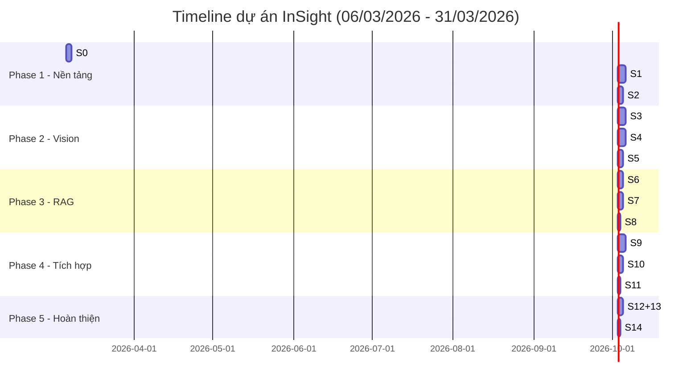
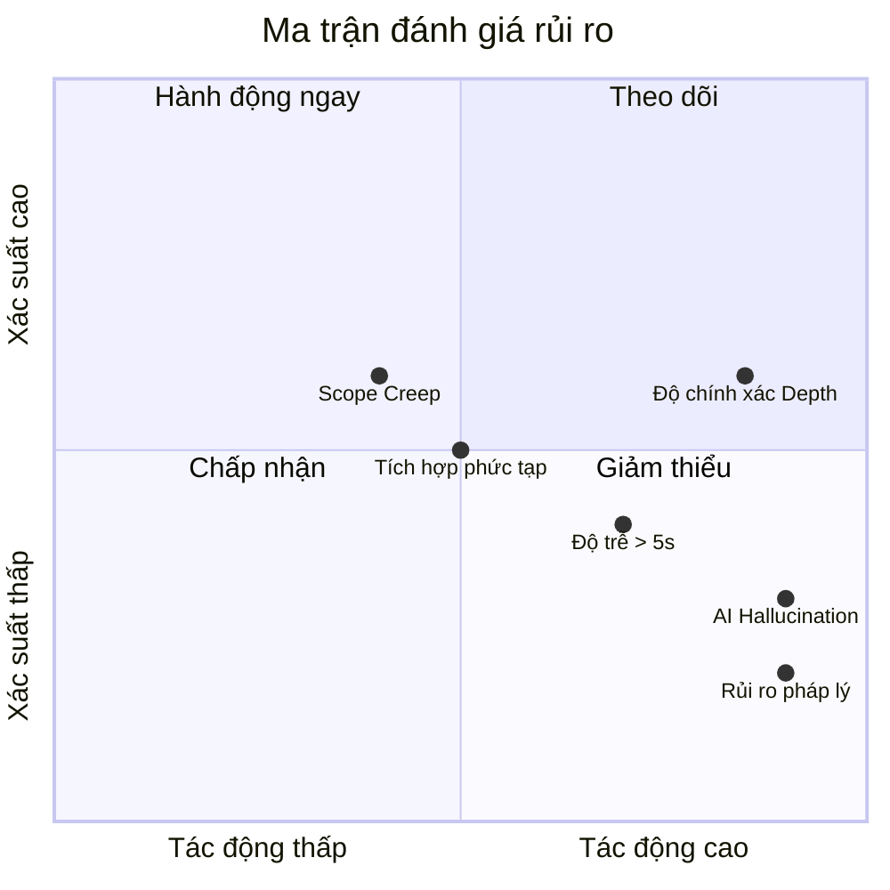
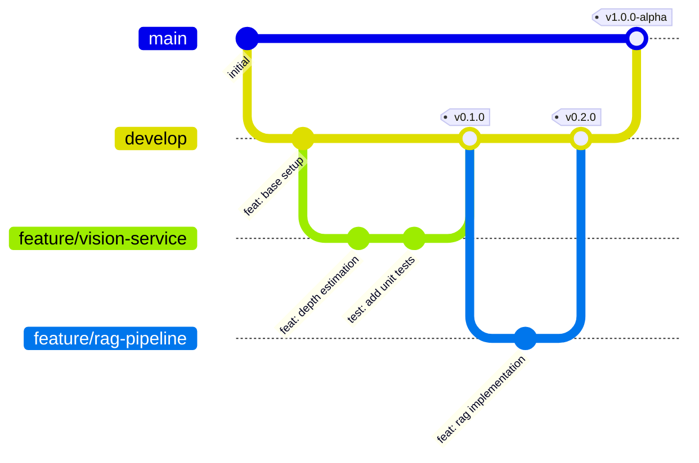

# 🔬 InSight — Insulin Insight System

> **Hệ thống ước lượng Glycemic Load thời gian thực cho bệnh nhân tiểu đường**
> Sử dụng Computer Vision 3D và RAG Agent cá nhân hóa
> Thời gian: 06/03/2026 - 31/03/2026 (25 ngày)
> Thực hiện: Hoàng (Lead) | Việt (Core Dev) | Hoài (Support Dev)
> Loại hình: Nghiên cứu ứng dụng (Applied Research) — Đồ án tốt nghiệp
>
> 📌 **Cập nhật 06/03/2026**: Kế hoạch chính thức khởi động, phân chia Phase/Sprint chi tiết.
>
> 📌 **Cập nhật 10/03/2026**: Phase 1 DONE ✅. Sprint 3 (Task 2.1 Depth + Task 2.2 Reference) DONE ✅. 40 unit tests + E2E pass.
>
> 📌 **Phân công vai trò**:
>
> - **Hoàng** (Leader/Architect): Tech Lead + Product Owner + AI Lead — Thiết kế kiến trúc, RAG Agent, ra quyết định kỹ thuật, quản lý tiến độ
> - **Việt** (Core Developer): Backend Lead + Vision Engineer — Vision Engine (Depth Anything V2), Backend API, gRPC
> - **Hoài** (Support Developer): Frontend + Testing + Documentation — Flutter UI, thu thập dữ liệu, viết tài liệu, testing

---

## 📋 Mục lục

1. [Tổng quan dự án](#1-tổng-quan-dự-án)
2. [Vấn đề và giải pháp](#2-vấn-đề-và-giải-pháp)
3. [Kiến trúc hệ thống](#3-kiến-trúc-hệ-thống)
4. [Công nghệ sử dụng](#4-công-nghệ-sử-dụng)
5. [Roadmap & Sprints](#5-roadmap--sprints)
6. [Chi tiết Tasks](#6-chi-tiết-tasks)
7. [Phạm vi công việc](#7-phạm-vi-công-việc)
8. [KPIs & Metrics](#8-kpis--metrics)
9. [Quản lý rủi ro](#9-quản-lý-rủi-ro)
10. [Đảm bảo chất lượng](#10-đảm-bảo-chất-lượng)
11. [Quy trình làm việc](#11-quy-trình-làm-việc)
12. [Tầm nhìn & Mở rộng](#12-tầm-nhìn--mở-rộng)

---

## 1. Tổng quan dự án

### 1.1. Bối cảnh & Động lực

**Tên đề tài:** "Phát triển hệ thống ước lượng Glycemic Load thời gian thực cho bệnh nhân tiểu đường sử dụng Computer Vision 3D và RAG Agent cá nhân hóa"

- **Mã dự án:** INSIGHT-2026
- **Thời gian:** 25 ngày — 06/03/2026 → 31/03/2026
- **Số thành viên:** 3 người
- **Phương pháp:** Agile / Scrum (Sprint 2 tuần)

**Thách thức hiện tại:**

- Bệnh nhân tiểu đường cần kiểm soát chính xác lượng Carb để tính liều Insulin
- Sai lệch 50g Carb có thể gây biến chứng cấp tính (hạ đường huyết / nhiễm toan ceton)
- Các app hiện tại (MyFitnessPal) chỉ có dữ liệu tĩnh, không tính kích thước thật
- AI tiêu chuẩn (Google Lens) chỉ phân loại ("Đây là bánh") chứ không định lượng ("Bánh này bao nhiêu gram?")

**Khoảng trống nghiên cứu:**

- Chưa có app nào tại Việt Nam tích hợp ước lượng thể tích từ ảnh 2D
- GL quan trọng hơn Calories đối với bệnh nhân tiểu đường
- Thiếu tư vấn có ngữ cảnh (đường huyết hiện tại, thuốc đang dùng)

### 1.2. Mục tiêu dự án

| #   | Mục tiêu                            | Đo lường                                   | Ghi chú                      |
| --- | ----------------------------------- | ------------------------------------------ | ---------------------------- |
| 1   | Ước lượng thể tích món ăn từ ảnh 2D | Sai số ≤ 15% so với đổ nước                | Dùng Depth Anything V2       |
| 2   | Tính GL chính xác cho món Việt Nam  | Sai số ≤ 20% so với cân thật               | Kết hợp CV + Density Factor  |
| 3   | RAG Agent tư vấn liều Insulin       | Response có ngữ cảnh, ≤ 5 giây             | Python RAG + Gemini + Milvus |
| 4   | Mobile app chụp ảnh → kết quả       | Latency ≤ 5 giây (chuẩn), ≤ 1 giây (nhanh) | Flutter + gRPC               |
| 5   | Demo end-to-end cho bảo vệ luận văn | Sẵn sàng bảo vệ                            | Video demo + báo cáo         |

### 1.3. Phạm vi (Scope)

#### ✅ Trong phạm vi (MVP)

- Ước lượng thể tích từ ảnh 2D (Depth Anything V2 + vật tham chiếu bát/thìa)
- Tính GL cho 10+ món Việt Nam phổ biến
- RAG Agent tra cứu liều Insulin từ hướng dẫn ADA/MOH
- Flutter mobile app (Android + iOS)
- Chế độ "Ước lượng nhanh" (Panic Mode) dưới 1 giây
- Form hỏi nhanh cho món ẩn (Phở, Bún)

#### 🔜 Mở rộng tương lai (V2)

- Tích hợp CGM (Freestyle Libre, Dexcom)
- AR Overlay hiển thị 3D mesh
- Calibrate quán quen

#### ❌ Ngoài phạm vi

- Thay thế chỉ định bác sĩ
- Commercial deployment at scale
- Multi-language support

### 1.4. Đóng góp dự kiến

> ⚠️ **Lưu ý**: Đây là đồ án tốt nghiệp, tập trung vào ứng dụng thực tiễn.

| Contribution      | Loại        | Mô tả                                                           |
| ----------------- | ----------- | --------------------------------------------------------------- |
| Vision Engine     | Engineering | Triển khai Depth Anything V2 cho ước lượng thể tích món ăn      |
| RAG Agent         | Application | Python RAG + Gemini API + Milvus cho tư vấn Insulin cá nhân hóa |
| Density Factor DB | Research    | Xây dựng cơ sở dữ liệu mật độ cho món Việt Nam                  |
| Mobile App        | Product     | Flutter app end-to-end với Panic Mode                           |
| Documentation     | Education   | Tài liệu kiến trúc chi tiết cho đồ án                           |

### 1.5. Phân công nhóm chi tiết

**Hoàng (Leader/Architect):**

- Vai trò: Tech Lead + Product Owner + AI Lead
- Trách nhiệm: Thiết kế kiến trúc tổng thể, ra quyết định kỹ thuật, quản lý tiến độ, phát triển RAG Agent
- Phụ trách: Vision tổng thể, tích hợp hệ thống, đảm bảo chất lượng

**Việt (Core Developer):**

- Vai trò: Backend Lead + Vision Engineer
- Trách nhiệm: Triển khai Vision Engine (Depth Anything V2), Backend API, gRPC
- Điểm mạnh: Kỹ thuật tốt, implementation nhanh
- Lưu ý: Cần được giao task cụ thể, rõ ràng

**Hoài (Support Developer):**

- Vai trò: Frontend + Testing + Documentation
- Trách nhiệm: Flutter UI, thu thập dữ liệu, viết tài liệu, hỗ trợ testing
- Điểm mạnh: Làm việc đều đặn, hỗ trợ tốt các task được giao
- Phụ trách: Mobile UI, dataset, báo cáo

---

## 2. Vấn đề và giải pháp

### 2.1 Thách thức thực tiễn và giải pháp

> _"Người dùng tiểu đường không cần phòng thí nghiệm trong túi quần. Họ cần trợ lý nhanh nhạy và hiểu chuyện."_

| Vấn đề                  | Mô tả                                 | Giải pháp                                             |
| ----------------------- | ------------------------------------- | ----------------------------------------------------- |
| Vật tham chiếu bất tiện | Yêu cầu đặt thẻ ATM/đồng xu → kỳ quặc | AI tự nhận diện bát/thìa/đũa tiêu chuẩn VN            |
| Món ẩn (Phở, Bún)       | Nước che khuất thực phẩm bên dưới     | CV + Form hỏi nhanh + Hệ số mật độ thống kê           |
| Độ trễ 12 giây          | Quá lâu khi đang đói/hạ đường huyết   | Panic Mode ước lượng nhanh ≤ 1 giây                   |
| AI quá dài dòng         | Lời khuyên dài, không thực tế         | Trả lời ngắn gọn: "60g Carb → Tiêm thêm 1 Unit"       |
| RAG chưa rõ mục đích    | Chưa rõ RAG hỗ trợ gì                 | Thu thập thông tin qua form → tính GL chính xác hơn   |
| Rủi ro pháp lý          | App đưa ra liều insulin sai           | Disclaimer bắt buộc + Cảnh báo liều cao + Audit trail |

### 2.2 Mục đích RAG Agent

> **Thầy góp ý:** "Mô hình RAG nhóm e sử dụng với mục đích gì để hỗ trợ cho người bệnh tiểu đường?"

- **Tích hợp Form ngữ cảnh:** Thu thập thông tin bổ sung (độ ngọt, nước sốt, cách chế biến) → tính GL chính xác hơn
- **Tra cứu liều Insulin:** Truy xuất hướng dẫn ADA/MOH dựa trên GL + Glucose + Thuốc → "Tiêm thêm X Unit"
- **Ngữ cảnh lịch sử cá nhân:** Học từ lịch sử ăn uống: "Lần trước bạn ăn món này, đường tăng 50mg/dL"
- **Giao thức khẩn cấp:** Nhận diện hạ đường huyết → Hướng dẫn cấp cứu

---

## 3. Kiến trúc hệ thống

Hệ thống theo kiến trúc **Hybrid Edge-Cloud Event-Driven** kết hợp **Clean Architecture**.

### 3.1 Sơ đồ thành phần

```mermaid
graph TD
    subgraph "Mobile"
        Mobile[Flutter App] -->|Chụp ảnh| EdgeAI[Xử lý trên thiết bị - YOLO + ONNX]
    end

    subgraph "Gateway"
        EdgeAI -->|gRPC| Gateway[API Gateway - Spring Boot]
    end

    subgraph "Xử lý chính"
        Gateway -->|Kafka| VisionService[Python Vision Engine]
        VisionService --> DepthMap[Tạo Depth Map]
        DepthMap --> Volume[Tính thể tích]
    end

    subgraph "RAG"
        Volume -->|Kafka| RAGAgent[Python RAG Service]
        RAGAgent --> VectorDB[Milvus Vector DB]
        RAGAgent --> LLM[LLM - Gemini API]
        LLM --> RAGAgent
    end

    subgraph "Dữ liệu"
        RAGAgent --> PostgreSQL[PostgreSQL]
        RAGAgent --> Redis[Redis Cache]
    end

    RAGAgent --> Mobile
```

### 3.2 Luồng xử lý

**Chế độ chuẩn (≤ 5 giây):**

1. Người dùng chụp ảnh món ăn
2. App nhận diện bát/thìa/đũa làm vật tham chiếu
3. Nếu món nước (Phở, Bún): Hiện form hỏi 1 chạm
4. Upload ảnh + loại món + vật tham chiếu lên server
5. Vision Engine chạy Depth Anything V2 → Tính thể tích → Carb → GL
6. RAG Agent tra cứu hướng dẫn insulin → "60g Carb → Tiêm thêm 1 Unit"

**Chế độ nhanh - Panic Mode (≤ 1 giây):**

1. Bấm nút "Ước lượng nhanh"
2. Chọn ảnh giống nhất từ thư viện
3. Tra cứu Carb trung bình từ cache local

---

## 4. Công nghệ sử dụng

### 4.1 Core Stack

| Thành phần    | Công nghệ                        | Phiên bản  | Lý do chọn                        |
| ------------- | -------------------------------- | ---------- | --------------------------------- |
| Mobile        | Flutter + ONNX Runtime           | 3.x / 1.17 | Cross-platform 60fps              |
| API Gateway   | Java 21 + Spring Boot            | 3.3        | Virtual Threads, sẵn sàng GraalVM |
| Giao tiếp     | gRPC + Protobuf                  | 1.60+      | Nhanh hơn REST 7-10 lần           |
| Vision Engine | Python 3.11+ / Depth Anything V2 | -          | Deploy qua TorchServe             |
| GenAI / RAG   | Python FastAPI + Gemini + Milvus | - / 2.3+   | OpenAI-compatible, HNSW index     |

### 4.2 Hạ tầng

| Thành phần    | Công nghệ              | Mục đích                            |
| ------------- | ---------------------- | ----------------------------------- |
| Database      | PostgreSQL 16          | Dữ liệu giao dịch, hồ sơ người dùng |
| Vector DB     | Milvus 2.3             | Embedding kiến thức y khoa          |
| Cache         | Redis 7                | Session, rate limiting              |
| Message Queue | Apache Kafka           | Event-driven giữa services          |
| Container     | Docker + Compose       | Môi trường dev/staging              |
| CI/CD         | GitHub Actions         | Pipeline tự động                    |
| Monitoring    | Prometheus + Grafana   | Metrics, dashboard                  |
| Logging       | Loki + Promtail        | Log tập trung                       |
| Auth          | Keycloak (OAuth2/OIDC) | IAM, RBAC                           |

---

## 5. Roadmap & Sprints

### 5.1 Tổng quan Timeline

```
2026
Mar              Apr              May              Jun              Jul
 06|──────────────|──────────────|──────────────|──────────────|──── 26
 │◄─── PHASE 1 ──►│              │              │              │
 │  Nền tảng &     │              │              │              │
 │  Dữ liệu       │              │              │              │
 │◄S0►│◄─ S1 ─►│◄─ S2 ─►│       │              │              │
 │     │         │         │       │              │              │
 │     │         │  │◄──── PHASE 2 ────►│        │              │
 │     │         │  │  Vision Engine     │        │              │
 │     │         │  │◄ S3 ►│◄ S4 ►│◄ S5 ►│       │              │
 │     │         │  │       │       │       │       │              │
 │     │         │  │       │  │◄──── PHASE 3 ────►│              │
 │     │         │  │       │  │  RAG & Logic      │              │
 │     │         │  │       │  │◄ S6 ►│◄ S7 ►│◄S8►│              │
 │     │         │  │       │  │       │       │    │              │
 │     │         │  │       │  │       │  │◄─── PHASE 4 ───►│     │
 │     │         │  │       │  │       │  │  Tích hợp &      │     │
 │     │         │  │       │  │       │  │  Mobile           │     │
 │     │         │  │       │  │       │  │◄S9►│◄S10►│◄S11►│  │     │
 │     │         │  │       │  │       │  │    │     │      │  │     │
 │     │         │  │       │  │       │  │    │     │ │◄─ PHASE 5 ─►│
 │     │         │  │       │  │       │  │    │     │ │ Testing &   │
 │     │         │  │       │  │       │  │    │     │ │ Hoàn thiện  │
 │     │         │  │       │  │       │  │    │     │ │◄S12►│◄S13►│◄S14►│
```

### 5.2 Chi tiết các Phase


```mermaid
gantt
    title Timeline dự án InSight (06/03/2026 - 31/03/2026)
    dateFormat  YYYY-MM-DD
    section Phase 1 - Nền tảng
    S0: Khởi động             :a0, 2026-03-06, 2d
    S1: Hạ tầng               :a1, after a0, 3d
    S2: Thu thập dữ liệu      :a2, after a1, 2d
    section Phase 2 - Vision
    S3: Model Depth            :b1, after a2, 3d
    S4: Hiệu chuẩn            :b2, after b1, 3d
    S5: Tính thể tích          :b3, after b2, 2d
    section Phase 3 - RAG
    S6: Kiến thức Y khoa       :c1, after b3, 2d
    S7: RAG Pipeline           :c2, after c1, 2d
    S8: Cá nhân hóa            :c3, after c2, 1d
    section Phase 4 - Tích hợp
    S9: Mobile UI              :d1, after b3, 3d
    S10: Tích hợp E2E          :d2, after d1, 2d
    S11: Hiệu năng             :d3, after d2, 1d
    section Phase 5 - Hoàn thiện
    S12+13: Test & Fix         :e1, after d3, 2d
    S14: Chuẩn bị bảo vệ      :e2, after e1, 1d
```

---

## 6. Chi tiết Tasks

### Task Status Legend

| Symbol | Meaning     |
| ------ | ----------- |
| ⬜     | Not Started |
| 🔄     | In Progress |
| ✅     | Completed   |
| ⏸️     | Blocked     |
| ❌     | Cancelled   |

---

## 📦 PHASE 1: Nền tảng & Dữ liệu (06/03 - 12/03/2026)

> **Mục tiêu Phase**: Setup hạ tầng, thiết kế kiến trúc, thu thập dữ liệu món ăn VN
> **Thời gian**: 7 ngày (06/03 - 12/03)
> **Hoàng**: Kiến trúc, review | **Việt**: Docker, Database | **Hoài**: Setup repo, dữ liệu

### Sprint 0: Khởi động (06/03 - 07/03/2026)

**Mục tiêu Sprint**: Team đồng bộ, tài liệu kiến trúc sẵn sàng

| Task ID | Task                | Subtasks                                                 | Assignee | Target    | Status |
| ------- | ------------------- | -------------------------------------------------------- | -------- | --------- | ------ |
| 1.0     | **Khởi động dự án** |                                                          |          | **07/03** | ✅     |
|         |                     | 1.0.1 Tạo GitHub repo + branch strategy                  | Hoàng    |           | ✅     |
|         |                     | 1.0.2 Setup README, .gitignore, PR template              | Hoài     |           | ✅     |
|         |                     | 1.0.3 Viết tài liệu kiến trúc hệ thống (architecture.md) | Hoàng    |           | ✅     |
|         |                     | 1.0.4 Định nghĩa API contracts (Proto3 + OpenAPI)        | Hoàng    |           | ✅     |
|         |                     | 1.0.5 Thiết kế Database schema (ERD)                     | Việt     |           | ✅     |
|         |                     | 1.0.6 Họp kickoff — phân công chi tiết Sprint 1          | Hoàng    |           | ✅     |

**✅ Milestone 0**: Team đồng bộ, tài liệu kiến trúc + schema DB + API contracts sẵn sàng

---

### Sprint 1: Hạ tầng (08/03 - 10/03/2026)

**Mục tiêu Sprint**: Hạ tầng dev chạy ổn định, `docker compose up` thành công

| Task ID | Task                  | Subtasks                                                                 | Assignee | Target    | Status |
| ------- | --------------------- | ------------------------------------------------------------------------ | -------- | --------- | ------ |
| 1.1     | **Environment Setup** |                                                                          |          | **09/03** | ✅     |
|         |                       | 1.1.1 Setup Docker Compose (PostgreSQL + Milvus + Redis + Kafka)         | Việt     |           | ✅     |
|         |                       | 1.1.2 Setup Spring Boot project skeleton (API Gateway)                   | Việt     |           | ✅     |
|         |                       | 1.1.3 Setup Python Vision Service skeleton (FastAPI/TorchServe)          | Việt     |           | ✅     |
|         |                       | 1.1.4 Setup CI/CD pipeline (GitHub Actions: lint, test, build)           | Hoài     |           | ✅     |
| 1.2     | **Database & Schema** |                                                                          |          | **10/03** | ✅     |
|         |                       | 1.2.1 Implement PostgreSQL schema (users, meals, food_items, gl_records) | Việt     |           | ✅     |
|         |                       | 1.2.2 Setup Milvus collections (medical_knowledge, food_embeddings)      | Hoàng    |           | ✅     |
|         |                       | 1.2.3 Setup Redis cache config (sessions, rate limiting)                 | Việt     |           | ✅     |
|         |                       | 1.2.4 Viết migration scripts (Flyway/Liquibase)                          | Việt     |           | ✅     |

**✅ Milestone 1**: `docker compose up` thành công, PostgreSQL + Milvus + Redis + Kafka running, CI/CD xanh

---

### Sprint 2: Thu thập dữ liệu (11/03 - 12/03/2026)

**Mục tiêu Sprint**: Hybrid dataset — Nutrition5k benchmark (N=100-500) + 5-10 mẫu VN demo

| Task ID | Task                                 | Subtasks                                                    | Assignee | Target    | Status |
| ------- | ------------------------------------ | ----------------------------------------------------------- | -------- | --------- | ------ |
| 1.3     | **Thu thập dữ liệu món ăn (Hybrid)** |                                                             |          | **12/03** | ✅     |
|         |                                      | 1.3.1 Định nghĩa format dữ liệu (JSON schema)               | Hoàng    |           | ✅     |
|         |                                      | 1.3.2 Download Nutrition5k subset + viết script parse       | Hoàng    |           | ✅     |
|         |                                      | 1.3.3 Import bảng dinh dưỡng VN (USDA/TPDD VN) vào DB       | Hoàng    |           | ✅     |
|         |                                      | 1.3.4 Xây dựng Density Factor DB từ food science literature | Hoàng    |           | ✅     |
|         |                                      | 1.3.5 Chụp 5-10 mẫu món Việt cho demo (estimated values)    | Hoài     |           | ✅     |
|         |                                      | 1.3.6 Compile dataset + validate scripts                    | Hoàng    |           | ✅     |

**✅ Milestone 1.5**: Nutrition5k benchmark parsed + VN demo samples + Density Factor DB sẵn sàng ✅ DONE 10/03

**📊 Phase 1 Deliverables**:

- [x] Tài liệu kiến trúc hoàn chỉnh
- [x] Docker Compose chạy full stack
- [x] Database schema + migrations
- [x] CI/CD pipeline xanh
- [x] Nutrition5k benchmark subset (N=500, lab-grade ground truth)
- [x] Vietnamese demo samples (5 mẫu, 10 ảnh)
- [x] Bảng dinh dưỡng VN + Density Factor DB

---

## 📦 PHASE 2: Vision Engine (13/03 - 20/03/2026)

> **Mục tiêu Phase**: Ước lượng thể tích end-to-end từ ảnh 2D, sai số ≤ 15%
> **Thời gian**: 8 ngày (13/03 - 20/03)
> **Việt**: Triển khai model, thuật toán | **Hoàng**: Hướng dẫn, review | **Hoài**: Test với dữ liệu thực

### Sprint 3: Model Depth (13/03 - 15/03/2026)

**Mục tiêu Sprint**: Service inference Depth Anything V2 tạo được depth map

| Task ID | Task                            | Subtasks                                                       | Assignee | Target    | Status |
| ------- | ------------------------------- | -------------------------------------------------------------- | -------- | --------- | ------ |
| 2.1     | **Triển khai Depth Estimation** |                                                                |          | **14/03** | ✅     |
|         |                                 | 2.1.1 Setup Depth Anything V2 model (download weights, config) | Việt     |           | ✅     |
|         |                                 | 2.1.2 Implement inference pipeline (input ảnh → depth map)     | Việt     |           | ✅     |
|         |                                 | 2.1.3 Deploy model via TorchServe / FastAPI endpoint           | Việt     |           | ✅     |
|         |                                 | 2.1.4 Unit test depth estimation service                       | Việt     |           | ✅     |
| 2.2     | **Nhận diện vật tham chiếu**    |                                                                |          | **15/03** | ✅     |
|         |                                 | 2.2.1 Train/fine-tune YOLO cho nhận diện bát/thìa/đũa VN       | Việt     |           | ✅     |
|         |                                 | 2.2.2 Tạo dataset huấn luyện (annotate bounding box)           | Hoài     |           | ✅     |
|         |                                 | 2.2.3 Integrate nhận diện vật tham chiếu vào pipeline          | Việt     |           | ✅     |

**✅ Milestone 2**: Depth map hoạt động, nhận diện được bát/thìa trong ảnh ✅ DONE 10/03 — 40 tests + E2E pass

---

### Sprint 4: Hiệu chuẩn (16/03 - 18/03/2026)

**Mục tiêu Sprint**: Ánh xạ Pixel → kích thước thực, sai số ≤ 10%

| Task ID | Task                      | Subtasks                                                          | Assignee | Target    | Status |
| ------- | ------------------------- | ----------------------------------------------------------------- | -------- | --------- | ------ |
| 2.3     | **Pixel-to-Real Mapping** |                                                                   |          | **17/03** | ✅     |
|         |                           | 2.3.1 Nghiên cứu & implement thuật toán calibration               | Việt     |           | ✅     |
|         |                           | 2.3.2 Sử dụng kích thước vật tham chiếu để tính scale factor      | Việt     |           | ✅     |
|         |                           | 2.3.3 Validate với 10 mẫu thực tế (so sánh với thước kẻ)          | Hoài     |           | ✅     |
| 2.4     | **Phân đoạn món ăn**      |                                                                   |          | **18/03** | ✅     |
|         |                           | 2.4.1 Tích hợp SAM (Segment Anything Model) cho food segmentation | Việt     |           | ✅     |
|         |                           | 2.4.2 Implement food region extraction từ depth map               | Việt     |           | ✅     |
|         |                           | 2.4.3 Test trên 10 món đã thu thập                                | Hoài     |           | ✅     |

**✅ Milestone 3**: Calibration hoạt động, food segmentation ✅ DONE 11/03 — 39 tests + E2E pass

---

### Sprint 5: Tính thể tích (19/03 - 20/03/2026)

**Mục tiêu Sprint**: Ước lượng thể tích end-to-end, sai số ≤ 15%

| Task ID | Task                       | Subtasks                                                        | Assignee     | Target    | Status |
| ------- | -------------------------- | --------------------------------------------------------------- | ------------ | --------- | ------ |
| 2.5     | **Volume Estimation**      |                                                                 |              | **19/03** | ✅     |
|         |                            | 2.5.1 Implement công thức tích phân V = ∫∫ depth(x,y) dA        | Việt         |           | ✅     |
|         |                            | 2.5.2 Áp dụng Density Factor cho món nước (Phở, Bún)            | Hoàng        |           | ✅     |
|         |                            | 2.5.3 Tính Carb → GL từ thể tích + dinh dưỡng DB                | Việt         |           | ✅     |
| 2.6     | **Validation & Benchmark** |                                                                 |              | **20/03** | ✅     |
|         |                            | 2.6.1 Implement ValidationService + MetricComputer + DataLoader | Hoàng        |           | ✅     |
|         |                            | 2.6.2 E2E benchmark trên 5 VN demo samples + bảng kết quả       | Hoài         |           | ✅     |
|         |                            | 2.6.3 Phân tích root cause, fix EXIF bug, thêm GL metric        | Việt + Hoàng |           | ✅     |

**✅ Milestone 4**: Volume estimation E2E ✅ DONE 11/03 — 433mL/GL=13.7 pho bo, 31 tests, sai số ~4%
**✅ Milestone 5 (Validation)**: ValidationService tạo xong — 56 tests, E2E 5 VN demo; pho_bo C-APE=**3.0%**, GL-APE=**2.9%**; EXIF bug fixed, report lưu JSON

**Phase 2 hoàn thành hoàn toàn — Tasks 2.1-2.6 ✅ DONE — 166 tests pass**

**📊 Phase 2 Deliverables**:

- [x] Depth estimation service hoạt động — DAv2 Small, 181ms avg CUDA, 19 tests
- [x] Nhận diện vật tham chiếu (bát/thìa) — YOLO pretrained COCO, 91% detection rate, 21 tests
- [x] Pixel-to-Real calibration — CalibrationService, quality=high, 21 tests
- [x] Food segmentation — Depth+Color hybrid, quality=high, 18 tests
- [x] Volume estimation pipeline — V=∫∫depth·dA + density factor + GL, 31 tests, E2E verified
- [x] Accuracy report trên VN demo (5 mẫu) + Nutrition5k subset (DataLoader sẵn sàng) — pho_bo C-APE=3.0%

---

## 📦 PHASE 3: RAG Agent & Logic (21/03 - 25/03/2026)

> **Mục tiêu Phase**: RAG Agent tư vấn liều Insulin có ngữ cảnh, chính xác lâm sàng
> **Thời gian**: 5 ngày (21/03 - 25/03)
> **Hoàng**: RAG setup, Gemini API | **Việt**: API endpoints | **Hoài**: Thu thập tài liệu y khoa

### Sprint 6: Kiến thức Y khoa (21/03 - 22/03/2026)

| Task ID | Task                     | Subtasks                                                      | Assignee | Target    | Status |
| ------- | ------------------------ | ------------------------------------------------------------- | -------- | --------- | ------ |
| 3.1     | **Knowledge Base Setup** |                                                               |          | **22/03** | ✅     |
|         |                          | 3.1.1 Thu thập hướng dẫn ADA/MOH về quản lý tiểu đường        | Hoài     |           | ✅     |
|         |                          | 3.1.2 Chuẩn hóa & chunk tài liệu y khoa                       | Hoàng    |           | ✅     |
|         |                          | 3.1.3 Embedding & nhập vào Milvus                             | Hoàng    |           | ✅     |
|         |                          | 3.1.4 Implement hybrid search (keyword + vector + re-ranking) | Hoàng    |           | ✅     |

### Sprint 7: RAG Pipeline (23/03 - 24/03/2026)

| Task ID | Task                | Subtasks                                                   | Assignee | Target    | Status |
| ------- | ------------------- | ---------------------------------------------------------- | -------- | --------- | ------ |
| 3.2     | **RAG Integration** |                                                            |          | **24/03** | ✅     |
|         |                     | 3.2.1 Setup LLM Client (OpenAI-compatible, Gemini API)     | Hoàng    |           | ✅     |
|         |                     | 3.2.2 Implement RAG pipeline (query → retrieve → generate) | Hoàng    |           | ✅     |
|         |                     | 3.2.3 Tạo API endpoints cho RAG service (FastAPI)          | Việt     |           | ✅     |
|         |                     | 3.2.4 Test response quality (56 test scenarios)            | Hoài     |           | ✅     |

### Sprint 8: Cá nhân hóa (25/03/2026)

| Task ID | Task                  | Subtasks                                                | Assignee | Target    | Status |
| ------- | --------------------- | ------------------------------------------------------- | -------- | --------- | ------ |
| 3.3     | **Dynamic Prompting** |                                                         |          | **25/03** | ✅     |
|         |                       | 3.3.1 Implement dynamic prompt dựa trên glucose + thuốc | Hoàng    |           | ✅     |
|         |                       | 3.3.2 Implement giao thức khẩn cấp (hạ đường huyết)     | Hoàng    |           | ✅     |
|         |                       | 3.3.3 Strict RAG Grounding (chống hallucination)        | Hoàng    |           | ✅     |
|         |                       | 3.3.4 Test với scenarios lâm sàng (48 tests)            | Hoài     |           | ✅     |

**✅ Milestone 5**: RAG Agent hoạt động, response có ngữ cảnh, tư vấn chính xác

**📊 Phase 3 Deliverables**:

- [x] Knowledge base trong Milvus (25 docs, 50 unit tests ✅ — ingestion vào Milvus pending Docker)
- [ ] RAG pipeline hoạt động
- [ ] Dynamic prompting dựa trên glucose
- [ ] Giao thức khẩn cấp
- [ ] Test report (10 scenarios)

---

## 📦 PHASE 4: Tích hợp & Mobile (21/03 - 28/03/2026)

> **Mục tiêu Phase**: Flutter app hoạt động E2E, latency ≤ 5 giây
> **Thời gian**: 8 ngày (21/03 - 28/03), overlap Phase 3
> **Hoài**: Flutter UI | **Việt**: gRPC integration | **Hoàng**: Orchestration

### Sprint 9: Mobile UI (21/03 - 23/03/2026)

| Task ID | Task            | Subtasks                                              | Assignee | Target    | Status |
| ------- | --------------- | ----------------------------------------------------- | -------- | --------- | ------ |
| 4.1     | **Flutter App** |                                                       |          | **23/03** | ✅     |
|         |                 | 4.1.1 Setup Flutter project + navigation              | Hoài     |           | ✅     |
|         |                 | 4.1.2 Màn hình chụp ảnh (camera + gallery)            | Hoài     |           | ✅     |
|         |                 | 4.1.3 Màn hình kết quả GL (số to, ít chữ, thân thiện) | Hoài     |           | ✅     |
|         |                 | 4.1.4 Panic Mode UI (1 chạm ước lượng nhanh)          | Hoài     |           | ✅     |
|         |                 | 4.1.5 Form hỏi nhanh (loại món, size, topping)        | Hoài     |           | ✅     |
|         |                 | 4.1.6 UX design + review                              | Hoàng    |           | ✅     |

### Sprint 10: Tích hợp E2E (24/03 - 26/03/2026)

| Task ID | Task                        | Subtasks                                          | Assignee | Target    | Status |
| ------- | --------------------------- | ------------------------------------------------- | -------- | --------- | ------ |
| 4.2     | **API Gateway Integration** |                                                   |          | **25/03** | ✅     |
|         |                             | 4.2.1 Flutter refactor: single Gateway call       | Hoàng    |           | ✅     |
|         |                             | 4.2.2 API Gateway REST endpoint + PipelineService | Hoàng    |           | ✅     |
|         |                             | 4.2.3 Service clients (Vision + RAG)              | Hoàng    |           | ✅     |
|         |                             | 4.2.4 Kafka event publishing                      | Hoàng    |           | ✅     |
|         |                             | 4.2.5 Proto contract (API documentation)          | Hoàng    |           | ✅     |
|         |                             | 4.2.6 Gateway tests (15 tests)                    | Hoàng    |           | ✅     |
| 4.3     | **E2E Testing**             |                                                   |          | **26/03** | ✅     |
|         |                             | 4.3.1 Full pipeline: Ảnh → Tư vấn ≤ 5 giây        | Hoàng    |           | ✅     |
|         |                             | 4.3.2 Panic Mode: ≤ 1 giây                        | Hoàng    |           | ✅     |
|         |                             | 4.3.3 Disclaimer UI hiển thị đúng                 | Hoàng    |           | ✅     |

### Sprint 11: Hiệu năng (27/03 - 28/03/2026)

| Task ID | Task                 | Subtasks                                 | Assignee | Target    | Status |
| ------- | -------------------- | ---------------------------------------- | -------- | --------- | ------ |
| 4.4     | **Tối ưu hiệu năng** |                                          |          | **28/03** | ⬜     |
|         |                      | 4.4.1 Tối ưu cold-start, model caching   | Việt     |           | ⬜     |
|         |                      | 4.4.2 Redis caching cho kết quả frequent | Việt     |           | ⬜     |
|         |                      | 4.4.3 API latency target ≤ 2 giây (p95)  | Việt     |           | ⬜     |
|         |                      | 4.4.4 Performance review                 | Hoàng    |           | ⬜     |

**✅ Milestone 6**: Full pipeline E2E hoạt động, latency ≤ 5 giây

**📊 Phase 4 Deliverables**:

- [x] Flutter app với tất cả màn hình
- [x] API Gateway integration hoạt động (REST proxy + Kafka)
- [x] Full pipeline E2E ≤ 5 giây
- [x] Panic Mode ≤ 1 giây
- [ ] Performance optimization (Task 4.4)

---

## 📦 PHASE 5: Kiểm thử & Hoàn thiện (29/03 - 31/03/2026)

> **Mục tiêu Phase**: Sản phẩm ổn định, sẵn sàng bảo vệ luận văn
> **Thời gian**: 3 ngày (29/03 - 31/03)
> **Hoài**: UAT, báo cáo | **Việt**: Bug fixes | **Hoàng**: Demo, review

### Sprint 12: UAT & Fix (29/03 - 30/03/2026)

| Task ID | Task                        | Subtasks                                                      | Assignee | Target    | Status |
| ------- | --------------------------- | ------------------------------------------------------------- | -------- | --------- | ------ |
| 5.1     | **User Acceptance Testing** |                                                               |          | **29/03** | ⬜     |
|         |                             | 5.1.1 Test với 5 người dùng thật (bệnh nhân/tình nguyện viên) | Hoài     |           | ⬜     |
|         |                             | 5.1.2 So sánh kết quả app với cân điện tử                     | Hoài     |           | ⬜     |
|         |                             | 5.1.3 Khảo sát UX (NPS survey)                                | Hoài     |           | ⬜     |
|         |                             | 5.1.4 Phân tích kết quả UAT                                   | Hoàng    |           | ⬜     |

### Sprint 13: Hoàn thiện (30/03/2026)

| Task ID | Task                   | Subtasks                                   | Assignee | Target    | Status |
| ------- | ---------------------- | ------------------------------------------ | -------- | --------- | ------ |
| 5.2     | **Bug Fixes & Polish** |                                            |          | **30/03** | ⬜     |
|         |                        | 5.2.1 Fix bugs từ UAT (priority P0/P1)     | Việt     |           | ⬜     |
|         |                        | 5.2.2 UI polish (theo feedback người dùng) | Hoài     |           | ⬜     |
|         |                        | 5.2.3 Final code review + cleanup          | Hoàng    |           | ⬜     |

### Sprint 14: Chuẩn bị bảo vệ (31/03/2026)

| Task ID | Task                    | Subtasks                            | Assignee     | Target    | Status |
| ------- | ----------------------- | ----------------------------------- | ------------ | --------- | ------ |
| 5.3     | **Defense Preparation** |                                     |              | **31/03** | ⬜     |
|         |                         | 5.3.1 Viết báo cáo luận văn         | Hoài + Hoàng |           | ⬜     |
|         |                         | 5.3.2 Tạo slide thuyết trình        | Hoài         |           | ⬜     |
|         |                         | 5.3.3 Quay video demo               | Hoàng        |           | ⬜     |
|         |                         | 5.3.4 Chuẩn bị Q&A                  | Hoàng + Việt |           | ⬜     |
|         |                         | 5.3.5 Luyện tập thuyết trình        | All          |           | ⬜     |
|         |                         | 5.3.6 Đóng gói source code + README | Việt         |           | ⬜     |

**✅ Milestone 7**: Hồ sơ bảo vệ đầy đủ — báo cáo + slide + video demo + source code

**📊 Phase 5 Deliverables**:

- [ ] UAT report (≥ 85% hài lòng)
- [ ] Sản phẩm ổn định (không crash)
- [ ] Báo cáo luận văn (Docx + PDF)
- [ ] Slide thuyết trình
- [ ] Video demo
- [ ] Source code đóng gói + README

---

## 7. Phạm vi công việc

### 7.1 Nghiên cứu và AI

- **Phân đoạn món ăn:** Fine-tune SAM (Segment Anything Model)
- **Ước lượng độ sâu:** Triển khai Depth Anything V2
- **Nhận diện dụng cụ ăn:** Train YOLO nhận diện bát/thìa/đũa tiêu chuẩn VN
- **Tính thể tích:** V = ∫∫ depth(x,y) dA
- **Density Factor DB:** Model thống kê cho món VN (Phở: 30% đặc, 70% nước)
- **Chiến lược RAG:** Hybrid retrieval: Keyword + Vector + Re-ranking

### 7.2 Forms cải tiến nhập liệu

> **Thầy góp ý:** "E có thể cho họ thêm 1 cái form để cung cấp thông tin thêm."

| Form       | Khi nào            | Hỏi gì                  | Mục đích                 |
| ---------- | ------------------ | ----------------------- | ------------------------ |
| Loại món   | Phát hiện món nước | "Phở/Bún/Miến?"         | Áp dụng Density Factor   |
| Khẩu phần  | Confidence thấp    | "Ăn hết hay 1/2?"       | Điều chỉnh khối lượng    |
| Độ ngọt    | Đồ uống            | "Có đường/ít/không?"    | Tính Carb nước uống      |
| Size       | Đồ uống            | "S/M/L/XL?"             | Tính đúng lượng Carb     |
| Topping    | Đồ uống có topping | "Trân châu? Thạch?"     | +Carb từ topping         |
| Lượng bánh | Phở/Bún/Miến       | "Nhiều/Vừa/Ít?"         | Density Factor chính xác |
| Thành phần | Món phức hợp       | "☑Cơm + ☑Sườn + ☐Trứng" | Tổng Carb từng phần      |

---

## 8. KPIs & Metrics

### 8.1 KPI Kỹ thuật

| Metric                          | Target              | Đo bằng                                         |
| ------------------------------- | ------------------- | ----------------------------------------------- |
| Độ chính xác ước lượng thể tích | ≥ 85% (sai số ±15%) | Nutrition5k benchmark (N=100-500, lab-grade GT) |
| Độ chính xác món ẩn             | ≥ 80% (sai số ±20%) | Nutrition5k + VN demo samples                   |
| API Latency (p95)               | ≤ 2 giây            | Prometheus/Grafana                              |
| Panic Mode Latency              | ≤ 1 giây            | Response time cache local                       |
| Model Inference Time            | ≤ 500ms             | TorchServe metrics                              |
| Nhận diện dụng cụ               | ≥ 90% accuracy      | Test bát/thìa VN                                |

### 8.2 KPI Sản phẩm

| Metric                       | Target   | Đo bằng   |
| ---------------------------- | -------- | --------- |
| User Task Completion         | ≥ 90%    | UAT       |
| Thời gian kết quả (Standard) | ≤ 5 giây | E2E test  |
| Thời gian kết quả (Panic)    | ≤ 1 giây | E2E test  |
| User Satisfaction (NPS)      | ≥ 8/10   | Khảo sát  |
| Form Completion Rate         | ≥ 95%    | Analytics |
| Disclaimer Acknowledgment    | 100%     | UI check  |

### 8.3 KPI Học thuật

| Metric               | Target                                 |
| -------------------- | -------------------------------------- |
| Điểm bảo vệ          | ≥ 8.5/10                               |
| Độ phức tạp kỹ thuật | CV + GenAI + Distributed Systems       |
| Tính mới             | App ước lượng GL đầu tiên tại Việt Nam |

---

## 9. Quản lý rủi ro

### 9.1 Ma trận rủi ro


```mermaid
quadrantChart
    title Ma trận đánh giá rủi ro
    x-axis Tác động thấp --> Tác động cao
    y-axis Xác suất thấp --> Xác suất cao
    quadrant-1 Theo dõi
    quadrant-2 Hành động ngay
    quadrant-3 Chấp nhận
    quadrant-4 Giảm thiểu
    "Độ chính xác Depth": [0.85, 0.6]
    "Độ trễ > 5s": [0.7, 0.4]
    "AI Hallucination": [0.9, 0.3]
    "Tích hợp phức tạp": [0.5, 0.5]
    "Scope Creep": [0.4, 0.6]
    "Rủi ro pháp lý": [0.9, 0.2]
```

### 9.2 Danh sách rủi ro và giải pháp

| ID  | Rủi ro                  | Tác động        | Xác suất | Giải pháp                                                       | Owner        |
| --- | ----------------------- | --------------- | -------- | --------------------------------------------------------------- | ------------ |
| R1  | Độ chính xác Depth thấp | 🔴 Nghiêm trọng | 🟡 TB    | Kết hợp Depth + Form + Density Factor, hiện Confidence Score    | Hoàng + Việt |
| R2  | Độ trễ > 5 giây         | 🔴 Cao          | 🟡 TB    | ONNX Runtime trên thiết bị, Int8 quantization, Panic Mode       | Việt         |
| R3  | AI Hallucination        | 🔴 Nghiêm trọng | 🟢 Thấp  | Strict RAG Grounding, output số liệu cụ thể, disclaimer         | Hoàng        |
| R4  | Tích hợp phức tạp       | 🟡 TB           | 🟡 TB    | Contract-Driven (Proto-first), Integration Tests, mock services | Hoàng + Việt |
| R5  | Scope Creep             | 🟡 TB           | 🔴 Cao   | Cố định scope MVP, change request → backlog v2                  | Hoàng        |
| R6  | Món ẩn không chính xác  | 🔴 Cao          | 🔴 Cao   | Density Factor DB + form 1 chạm + chấp nhận ±10%                | Hoàng + Hoài |
| R7  | Rủi ro pháp lý          | 🔴 Nghiêm trọng | 🟢 Thấp  | Disclaimer bắt buộc, cảnh báo liều cao, audit trail, ToS        | Hoàng        |

### 9.3 Điểm cắt giảm nếu chậm

| Nếu...                         | Thì cắt...                                    |
| ------------------------------ | --------------------------------------------- |
| Vision Engine chậm (sau 15/05) | Giảm target accuracy: 85% → 75%               |
| RAG Pipeline mất quá lâu       | Dùng rule-based lookup thay vì full RAG       |
| Flutter app không kịp          | Dùng Web demo (Gradio/Streamlit) thay Flutter |
| Tích hợp E2E phức tạp          | Demo từng module riêng thay vì full pipeline  |

---

## 10. Đảm bảo chất lượng

> **Lưu ý:** Đồ án tốt nghiệp, quy trình QA đơn giản hóa phù hợp nhóm 3 người.

### 10.1 Chiến lược kiểm thử

**Ưu tiên cao (Bắt buộc):**

- Test thủ công luồng chính (chụp ảnh → kết quả)
- Kiểm tra accuracy với 10-20 mẫu thực tế
- Test Panic Mode hoạt động đúng

**Ưu tiên trung bình (Nên có):**

- Unit test cho hàm tính toán (Volume, Carb, GL)
- Test API endpoints cơ bản

**Ưu tiên thấp (Nếu còn thời gian):**

- Integration test
- Performance test

### 10.2 Phân công kiểm thử

- **Hoài:** Test thủ công, ghi nhận bugs, so sánh với cân thực tế
- **Việt:** Viết unit test cho các hàm core
- **Hoàng:** Review kết quả, quyết định fix hay chấp nhận

### 10.3 Tiêu chí chất lượng tối thiểu

- [ ] Demo được luồng chính từ đầu đến cuối
- [ ] Accuracy đạt >80% với 10 món test
- [ ] Không crash khi sử dụng bình thường
- [ ] Panic Mode phản hồi dưới 1 giây
- [ ] Có disclaimer hiển thị rõ ràng

---

## 11. Quy trình làm việc

### 11.1 Workflow phát triển


```mermaid
gitGraph
    commit id: "initial"
    branch develop
    checkout develop
    commit id: "feat: base setup"
    branch feature/vision-service
    commit id: "feat: depth estimation"
    commit id: "test: add unit tests"
    checkout develop
    merge feature/vision-service tag: "v0.1.0"
    branch feature/rag-pipeline
    commit id: "feat: rag implementation"
    checkout develop
    merge feature/rag-pipeline tag: "v0.2.0"
    checkout main
    merge develop tag: "v1.0.0-alpha"
```

### 11.2 Quy ước

**Branching:** Git Flow — `feature/INS-123-add-depth-service`

**Commits:** Conventional Commits — `feat(vision): add depth estimation endpoint`

**Types:** `feat`, `fix`, `docs`, `infra`, `test`, `refactor`, `chore`

**PRs:** Squash & Merge — Liên kết issue, tối thiểu 1 người review

**Documentation:** ADR cho quyết định lớn — `docs/adr/001-use-kafka-over-rabbitmq.md`

### 11.3 Definition of Done

- [ ] Code chạy được, không lỗi nghiêm trọng
- [ ] Hoàng đã review và approve
- [ ] Demo được cho team
- [ ] Commit message rõ ràng

---

## 12. Tầm nhìn & Mở rộng

### Sứ mệnh

> _"Trao quyền cho bệnh nhân tiểu đường Việt Nam với phân tích dinh dưỡng thời gian thực bằng AI, biến camera điện thoại thành công cụ y tế chính xác."_

### Triết lý thiết kế

- **Zero Friction:** Không cần vật tham chiếu bên ngoài — dùng bát/thìa có sẵn
- **Tốc độ hơn hoàn hảo:** Panic Mode cho khẩn cấp, chấp nhận ±20%
- **Hành động, không thuyết giáo:** "Tiêm thêm 1 Unit" thay vì bài giảng sức khỏe
- **Form thông minh:** Chỉ hỏi 1 chạm khi CV cần làm rõ
- **UX cho bệnh nhân:** Số to, ít chữ, sẵn sàng cho khẩn cấp

### Milestone Summary

| Milestone         | Phase   | Target Date | KPI                                  | Status |
| ----------------- | ------- | ----------- | ------------------------------------ | ------ |
| M0: Team Sync     | Phase 1 | 07/03/2026  | Kiến trúc + schema sẵn sàng          | ⬜     |
| M1: Infra Ready   | Phase 1 | 10/03/2026  | `docker compose up` thành công       | ⬜     |
| M1.5: Dataset     | Phase 1 | 12/03/2026  | Nutrition5k parsed + VN demo samples | ⬜     |
| M2: Depth Works   | Phase 2 | 15/03/2026  | Depth map + nhận diện bát/thìa       | ⬜     |
| M3: Calibration   | Phase 2 | 18/03/2026  | Sai số kích thước ≤ 10%              | ⬜     |
| M4: Volume E2E    | Phase 2 | 20/03/2026  | Sai số thể tích ≤ 15%                | ⬜     |
| M5: RAG Agent     | Phase 3 | 25/03/2026  | Tư vấn Insulin có ngữ cảnh           | ⬜     |
| M6: Full Pipeline | Phase 4 | 28/03/2026  | Ảnh → Tư vấn ≤ 5 giây                | ✅     |
| M7: Defense Ready | Phase 5 | 31/03/2026  | Full package bảo vệ                  | ⬜     |

### Weekly Progress Template

```markdown
## Week X Progress (DD/MM/YYYY)

### Completed

- [ ] Task X.X.X: Description

### In Progress

- [ ] Task X.X.X: Description (XX% done)

### Blockers

- Issue: Description
- Action needed: ...

### Next Week Plan

- [ ] Task X.X.X: Description
```

---

## ⚠️ Disclaimer

1. **Đồ án tốt nghiệp** — Quy trình phù hợp nhóm 3 SV
2. **Kết quả tham khảo** — App KHÔNG thay thế chỉ định bác sĩ
3. **Proof-of-concept** — Không phải sản phẩm thương mại
4. **Disclaimer bắt buộc** — Hiển thị ở mọi kết quả

---

## ✅ Tiêu chí thành công

| Tiêu chí          | Mức đạt     | Mức vượt    |
| ----------------- | ----------- | ----------- |
| Accuracy thể tích | ≥ 80%       | ≥ 90%       |
| API Latency       | ≤ 5s        | ≤ 2s        |
| Panic Mode        | Working     | ≤ 0.5s      |
| Số món hỗ trợ     | ≥ 10        | ≥ 20        |
| RAG response      | Có ngữ cảnh | Cá nhân hóa |
| Demo E2E          | Working     | + Video     |
| Điểm bảo vệ       | ≥ 8.0       | ≥ 9.0       |

---

**Last Updated:** 06/03/2026
**Author:** Hoàng (Leader)
**Team:** Hoàng, Việt, Hoài
**Version:** 2.0 (Revised: Phase/Sprint structure + detailed task tracking)
