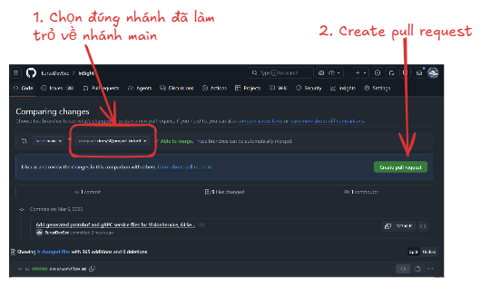
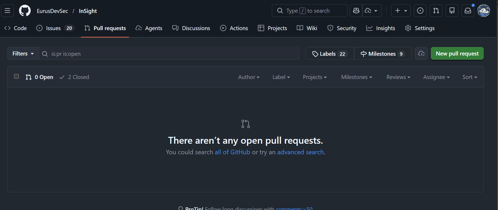
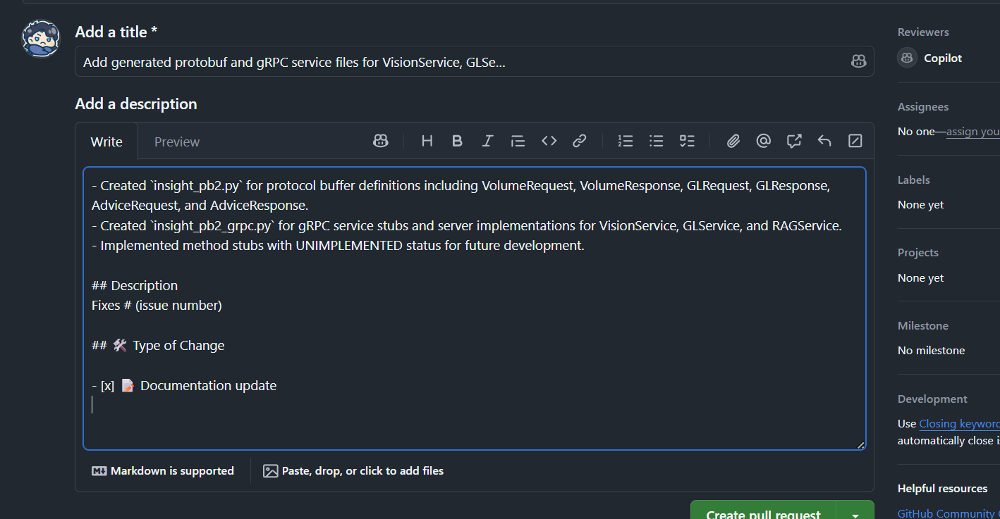
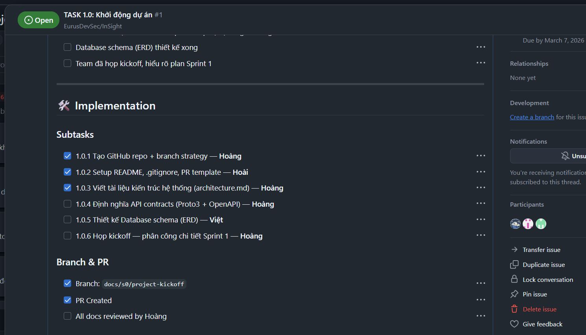

# File Hướng dẫn quy trình làm Task

## 1. Đầu tiên chọn Projects

## Sau đó chọn Insight Project

## Chọn đúng task của mình

## Sau đó kéo xuống phần `Branch & Pr`

## Mở termnial

## Vì đã có người `tạo nhánh` từ trước (nếu chung task) thì khi chạy lệnh sẽ ra như sau

> [!NOTE]
>
> # Lưu ý
>
> Làm theo đúng thứ tự và quy trình viết ra bởi file này

## Sau khi `tạo nhánh` hoặc `đổi nhánh` xong

## 1. Kéo đến phần `Implementation`

- **Làm phần**: `Subtaks`
  xong phần nào thì ✅ phần đấy

## 2. Kéo Lên trên `Acceptance Criteria`

- **Đây là phần test những subtask đã làm có đúng yêu cầu chưa**
  - Nếu đáp ứng thì ✅
  - Nếu không thì tiếp tục hoàn thành tasks rồi ✅ sau

## 3. Viết commit những gì đã làm

sau

## 4. cuối cùng kéo xuống dưới `Branch & PR`

- ✅ vào `Branch`
-
