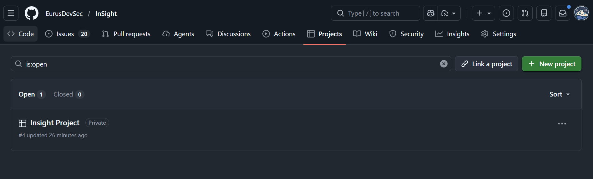
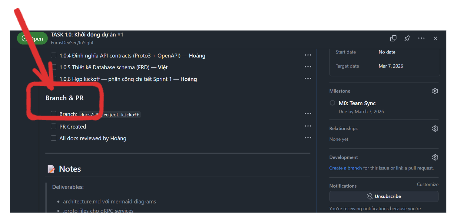
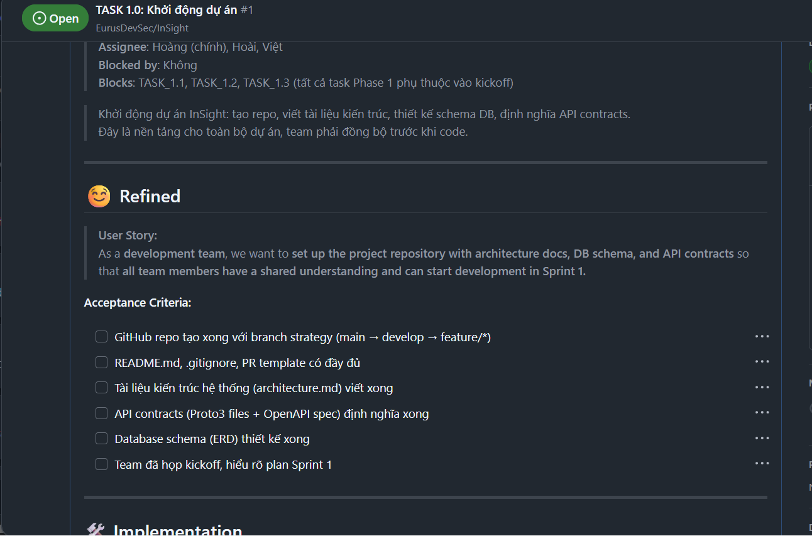
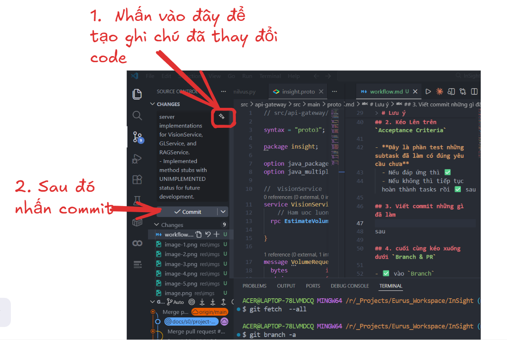
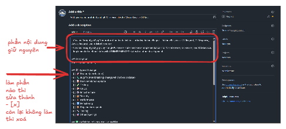

# 📋 Hướng dẫn quy trình làm Task

> **Áp dụng cho:** Tất cả thành viên trong team
> **Quy tắc:** Làm đúng thứ tự từ Bước 1 → Bước 5, không bỏ bước

---

## Bước 1: Mở Project Board trên GitHub

Vào repository trên GitHub → chọn tab **Projects**


Chọn đúng project của dự án (ví dụ: **Insight Project**)



---

## Bước 2: Chọn task được phân công

Trên bảng Kanban, tìm task của mình trong cột phù hợp (**Backlog** / **To do**), nhấn vào để mở chi tiết


Kéo xuống phần **Branch & PR** để xem tên nhánh cần tạo/chuyển



---

## Bước 3: Tạo nhánh và bắt đầu code

### 3.1 Mở terminal


### 3.2 Chạy các lệnh Git theo thứ tự

```bash
# 1. Lấy thông tin mới nhất từ server
git fetch --all

# 2. Xem tất cả nhánh (local + remote)
git branch -a
# Nhánh có "remotes/" là đang có trên GitHub

# 3. Tạo nhánh mới (nếu chưa có) hoặc chuyển sang nhánh đã có
git checkout -b feat/s1/environment-setup    # Tạo mới
# hoặc
git checkout feat/s1/environment-setup       # Chuyển sang nhánh đã có
```


> [!NOTE]
> ### ⚠️ Lưu ý quan trọng
> - Luôn `git fetch --all` trước khi bắt đầu làm việc
> - Tên nhánh phải khớp với tên trong phần **Branch & PR** của task
> - **KHÔNG** code trực tiếp trên nhánh `main` hoặc `develop`

---

## Bước 4: Làm task và cập nhật tiến độ

Sau khi tạo/chuyển nhánh xong, quay lại issue trên GitHub:

### 4.1 Làm Subtasks

Kéo đến phần **Implementation** → **Subtasks**


- Làm từng subtask được giao cho mình
- Hoàn thành subtask nào → ✅ tick vào checkbox của subtask đó
- Chỉ tick subtask của mình, **không tick của người khác**

> [!TIP]
> Đọc phần **Notes** ở cuối issue để nắm rõ yêu cầu chi tiết trước khi bắt đầu code

### 4.2 Kiểm tra Acceptance Criteria

Kéo lên phần **Acceptance Criteria**



- Đây là danh sách **tiêu chí đánh giá** xem task đã hoàn thành chưa
- Tự kiểm tra từng tiêu chí:
  - Đáp ứng → ✅ tick
  - Chưa đáp ứng → tiếp tục hoàn thiện rồi tick sau

### 4.3 Commit và Push code

Khi đã hoàn thành (hoặc một phần), commit code lên nhánh:

**Cách 1: Dùng VS Code UI**

Nhấn vào nút gợi ý commit → kiểm tra message → nhấn **Commit**



Sau đó nhấn **Sync Changes** để push code lên GitHub

**Cách 2: Dùng terminal**

```bash
git add .
git commit -m "feat(s1): setup docker compose cho PostgreSQL + Redis"
git push origin feat/s1/environment-setup
```

> [!IMPORTANT]
> ### Quy tắc viết commit message
> Format: `type(scope): mô tả ngắn gọn`
>
> | Type | Khi nào dùng |
> |------|-------------|
> | `feat` | Thêm tính năng mới |
> | `fix` | Sửa lỗi |
> | `docs` | Cập nhật tài liệu |
> | `infra` | Hạ tầng, config |
> | `test` | Thêm/sửa test |
> | `refactor` | Refactor code |
>
> Ví dụ: `feat(vision): add depth estimation endpoint`

---

## Bước 5: Tạo Pull Request (PR)

### 5.1 Mở trang Pull Requests

Vào tab **Pull requests** → nhấn **New pull request**


### 5.2 Chọn nhánh

- **base:** `develop` (hoặc `main` nếu lead yêu cầu)
- **compare:** nhánh của bạn (ví dụ: `feat/s1/environment-setup`)


### 5.3 Điền thông tin PR

Khi tạo PR, GitHub sẽ tự sinh template. Bạn cần:

1. **Giữ nguyên title** (hoặc sửa cho rõ nghĩa hơn)
2. **Điền mô tả** — ghi ngắn gọn những gì đã làm
3. **Type of Change** → tích ✅ vào loại thay đổi phù hợp, bỏ trống cái không liên quan



4. **DoD Checklist** → tích ✅ những mục đã đảm bảo


Sau đó nhấn **Create pull request**

> [!CAUTION]
> ### Chờ review trước khi merge!
> - PR tạo xong → **KHÔNG TỰ MERGE**
> - Chờ Hoàng (Lead) review và approve
> - Nếu có feedback → sửa code, commit thêm, push lên nhánh cũ (PR tự cập nhật)

### 5.4 Cập nhật trạng thái trong task

Quay lại issue, kéo xuống phần **Branch & PR**:

- Tích ✅ vào **Branch** (đã tạo nhánh)
- Tích ✅ vào **PR Created** (đã tạo PR)

---

## 🔁 Lặp lại cho task tiếp theo

> [!IMPORTANT]
> Khi task hiện tại đã được merge, thực hiện tương tự các bước trên cho task tiếp theo trong danh sách phân công của bạn.

---

## 📌 Tóm tắt quy trình

```
Bước 1: Mở Project Board → chọn task
         ↓
Bước 2: Đọc task → xem Branch & PR → biết tên nhánh
         ↓
Bước 3: git fetch → git checkout -b [nhánh] → bắt đầu code
         ↓
Bước 4: Code → tick Subtasks → tick Acceptance Criteria → commit & push
         ↓
Bước 5: Tạo PR → chờ review → tick Branch & PR trong task
         ↓
        🔁 Lặp lại cho task tiếp theo
```

---

> _Cập nhật: 06/03/2026 — Hoàng_
