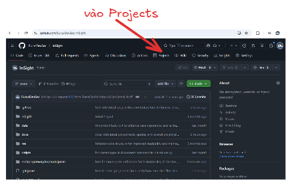
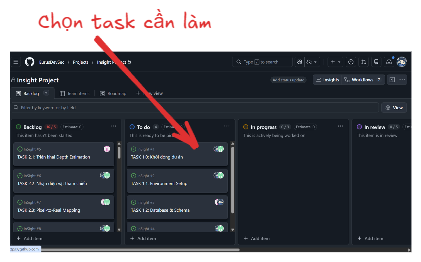
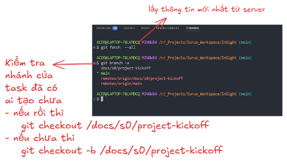
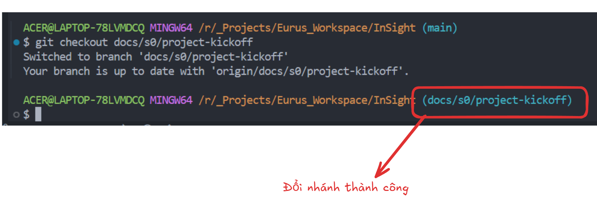

# File Hướng dẫn quy trình làm Task

## 1. Đầu tiên chọn Projects trong repository github

## Sau đó chọn Insight Project

## Chọn đúng task của mình

## Sau đó kéo xuống phần `Branch & Pr`

## Mở terminal

### Chạy lệnh

- `git fetch -all`
  Để lấy thông tin mới nhất từ Server
- `git branch -a`:
  Để xem có bao nhiêu nhánh trên Repository github tính cả local trên máy của bạn
- Phần nào có `Remote` thì là đang có trên github

> [!NOTE]
>
> # Lưu ý
>
> Làm theo đúng thứ tự và quy trình viết ra bởi file này

## Sau khi `tạo nhánh` hoặc `đổi nhánh` xong

## 1. Kéo đến phần `Implementation`

- **Làm phần**: `Subtask`
  xong phần nào thì ✅ phần đấy
  > [!TIP]
  > Xem phần NOTE ở dưới để nắm rõ yêu cầu

## 2. Kéo Lên trên `Acceptance Criteria`

- **Đây là phần test những subtask đã làm có đúng yêu cầu chưa**
  - Nếu đáp ứng thì ✅
  - Nếu không thì tiếp tục hoàn thành tasks rồi ✅ sau

## 3. Viết commit những gì đã làm và push lên nhánh đã làm

### Nhấn vào nút gợi ý commit khi nó gợi ý xong thì nhấn commit

### Sau đó nhấn `Sync Change` để đồng bộ code máy lên trên Repo

## 4. Vào phần `Pull Request` nhấn new pull request

### Sau đó

### Khi tạo pull request thì giữ nguyên title, nmội dung, còn type of change thì tích vào những cái đã làm, cái không liên quan thì bỏ đi

Sau đó nhấn `create pull request`

# Chờ được duyêt thì qua phần tiếp theo ở dưới

## 5. cuối cùng kéo xuống dưới `Branch & PR`

- Tích ✅ vào `Branch`
- Tích ✅ PR Created

> [!IMPORTANT]
> Tương tự các `task` tiếp theo
